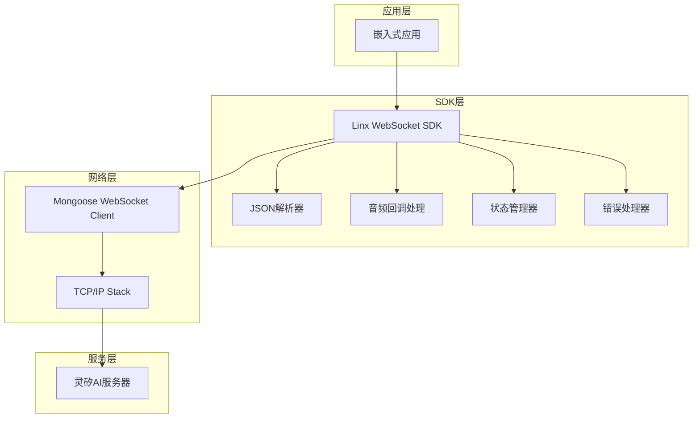
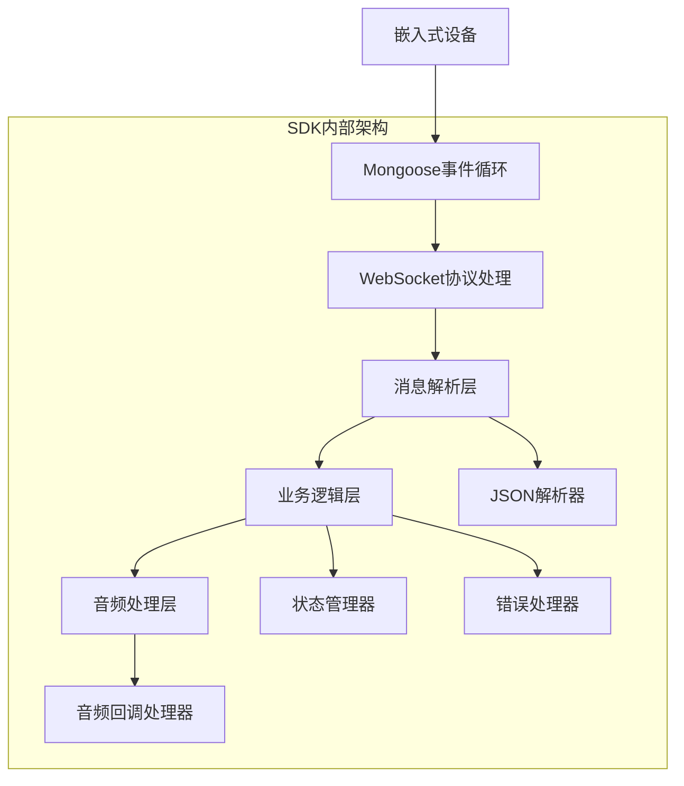
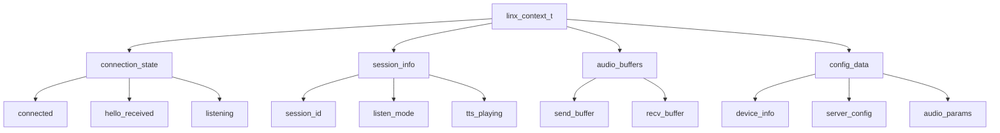

# 灵矽AI WebSocket嵌入式SDK技术架构文档

## 1. 架构设计



## 2. 技术描述

- **核心库**: Mongoose WebSocket客户端 + C99标准库
- **JSON处理**: 自实现轻量级JSON解析器（避免外部依赖）
- **音频处理**: 原始音频数据回调机制（不进行编解码）
- **内存管理**: 静态内存分配，适配嵌入式环境
- **线程模型**: 单线程事件驱动，基于Mongoose事件循环

## 3. 路由定义

SDK作为客户端库，主要连接到以下服务端点：

| 端点 | 用途 |
|------|------|
| wss://xrobo-io.qiniuapi.com/v1/ws/ | 主要WebSocket连接端点，用于语音交互和消息通信 |

## 4. API定义

### 4.1 核心API

#### 初始化和配置

```c
// SDK初始化
int linx_sdk_init(const linx_config_t *config);
```

请求参数:
| 参数名 | 参数类型 | 是否必需 | 描述 |
|--------|----------|----------|------|
| config | linx_config_t* | true | SDK配置结构体 |

配置结构体定义:
```c
typedef struct {
    char device_id[32];        // 设备MAC地址
    char client_id[64];        // 客户端UUID
    char access_token[256];    // 访问令牌（可选）
    char server_url[128];      // 服务器地址
    linx_audio_params_t audio; // 音频参数
    linx_callbacks_t callbacks; // 回调函数
} linx_config_t;
```

#### 连接管理

```c
// 建立连接
int linx_connect(void);
```

返回值:
| 参数名 | 参数类型 | 描述 |
|--------|----------|------|
| result | int | 0表示成功，负数表示错误码 |

#### 消息发送

```c
// 发送监听控制消息
int linx_start_listen(linx_listen_mode_t mode);
int linx_stop_listen(void);
```

请求参数:
| 参数名 | 参数类型 | 是否必需 | 描述 |
|--------|----------|----------|------|
| mode | linx_listen_mode_t | true | 监听模式：AUTO, MANUAL, REALTIME |

#### 音频传输

```c
// 发送原始音频数据
int linx_send_audio(const uint8_t *data, size_t len);
```

请求参数:
| 参数名 | 参数类型 | 是否必需 | 描述 |
|--------|----------|----------|------|
| data | uint8_t* | true | 原始音频数据 |
| len | size_t | true | 数据长度 |

#### 错误处理

```c
// 获取最后错误
int linx_get_last_error(char *error_msg, size_t msg_len);
```

返回值:
| 参数名 | 参数类型 | 描述 |
|--------|----------|------|
| error_code | int | 错误码 |
| error_msg | char* | 错误描述信息 |

### 4.2 回调函数定义

```c
typedef struct {
    void (*on_connected)(void);
    void (*on_disconnected)(int reason);
    void (*on_hello_received)(const linx_hello_msg_t *msg);
    void (*on_tts_status)(const linx_tts_msg_t *msg);
    void (*on_emotion)(const linx_emotion_msg_t *msg);
    void (*on_audio_data)(const uint8_t *data, size_t len);
    void (*on_error)(int error_code, const char *error_msg);
} linx_callbacks_t;
```

### 4.3 数据结构定义

```c
// 音频参数
typedef struct {
    char format[16];      // "pcm" 或 "raw"
    int sample_rate;      // 16000 (上行) / 24000 (下行)
    int channels;         // 1
    int bits_per_sample;  // 16
} linx_audio_params_t;

// Hello消息
typedef struct {
    char type[16];        // "hello"
    int version;          // 1
    char transport[16];   // "websocket"
    linx_audio_params_t audio_params;
} linx_hello_msg_t;

// TTS状态消息
typedef struct {
    char type[16];        // "tts"
    char state[32];       // "start", "stop", "sentence_start"
    char text[256];       // 播放文本（可选）
} linx_tts_msg_t;

// 情感状态消息
typedef struct {
    char type[16];        // "llm"
    char text[8];         // 表情符号
    char emotion[32];     // 情感标识
} linx_emotion_msg_t;

// 监听模式枚举
typedef enum {
    LINX_LISTEN_AUTO = 0,
    LINX_LISTEN_MANUAL = 1,
    LINX_LISTEN_REALTIME = 2
} linx_listen_mode_t;
```

## 5. 服务器架构图



## 6. 数据模型

### 6.1 数据模型定义

由于SDK是客户端库，不涉及数据库设计，但需要定义内存中的数据结构：



### 6.2 数据定义语言

核心数据结构定义：

```c
// SDK主上下文结构
typedef struct {
    // 连接状态
    struct {
        bool connected;
        bool hello_received;
        bool listening;
        time_t last_heartbeat;
    } connection_state;
    
    // 会话信息
    struct {
        char session_id[64];
        linx_listen_mode_t listen_mode;
        bool tts_playing;
        time_t session_start;
    } session_info;
    
    // 音频缓冲区
    struct {
        uint8_t send_buffer[LINX_AUDIO_BUFFER_SIZE];
        size_t send_buffer_len;
        uint8_t recv_buffer[LINX_AUDIO_BUFFER_SIZE];
        size_t recv_buffer_len;
    } audio_buffers;
    
    // 配置数据
    linx_config_t config;
    
    // Mongoose连接
    struct mg_connection *conn;
    struct mg_mgr mgr;
    
    // 错误信息
    struct {
        int last_error_code;
        char last_error_msg[256];
    } error_info;
    
} linx_context_t;

// 消息队列节点（用于异步消息处理）
typedef struct linx_msg_node {
    enum {
        LINX_MSG_JSON,
        LINX_MSG_AUDIO
    } type;
    
    union {
        struct {
            char *json_data;
            size_t json_len;
        } json;
        
        struct {
            uint8_t *audio_data;
            size_t audio_len;
        } audio;
    } data;
    
    struct linx_msg_node *next;
} linx_msg_node_t;

// 错误码定义
#define LINX_OK                    0
#define LINX_ERROR_INVALID_PARAM  -1
#define LINX_ERROR_NOT_CONNECTED  -2
#define LINX_ERROR_NETWORK        -3
#define LINX_ERROR_PROTOCOL       -4
#define LINX_ERROR_AUDIO          -5
#define LINX_ERROR_MEMORY         -6
#define LINX_ERROR_TIMEOUT        -7

// 配置常量
#define LINX_MAX_DEVICE_ID_LEN    32
#define LINX_MAX_CLIENT_ID_LEN    64
#define LINX_MAX_TOKEN_LEN        256
#define LINX_MAX_URL_LEN          128
#define LINX_AUDIO_BUFFER_SIZE    8192
#define LINX_JSON_BUFFER_SIZE     2048
#define LINX_MAX_RECONNECT_TIMES  5
#define LINX_HEARTBEAT_INTERVAL   30

// 音频参数常量
#define LINX_AUDIO_FORMAT         "pcm"
#define LINX_AUDIO_SAMPLE_RATE_UP 16000
#define LINX_AUDIO_SAMPLE_RATE_DN 24000
#define LINX_AUDIO_CHANNELS       1
#define LINX_AUDIO_BITS_PER_SAMPLE 16
```

### 6.3 内存管理策略

```c
// 静态内存分配策略（适合嵌入式环境）
static linx_context_t g_linx_context;
static linx_msg_node_t g_msg_pool[LINX_MAX_MSG_NODES];
static bool g_msg_pool_used[LINX_MAX_MSG_NODES];

// 内存池管理函数
static linx_msg_node_t* linx_alloc_msg_node(void);
static void linx_free_msg_node(linx_msg_node_t *node);
static void linx_init_memory_pool(void);
```