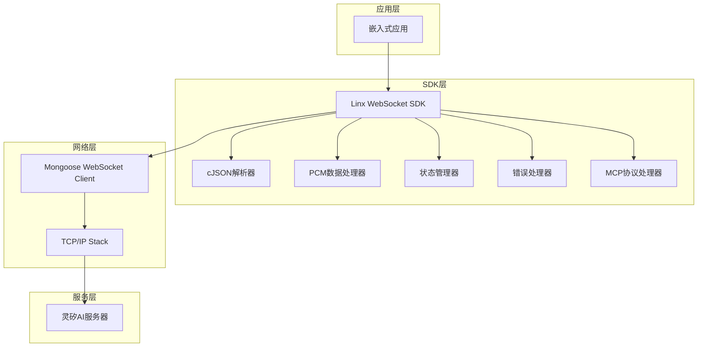
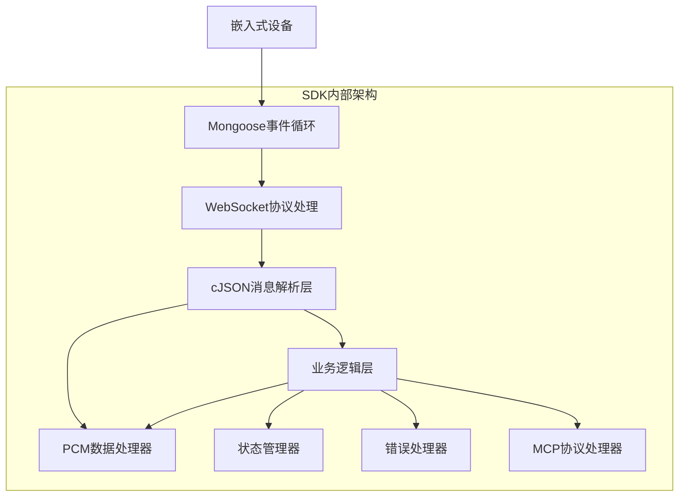
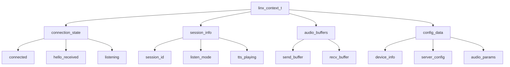

# 灵矽AI WebSocket嵌入式SDK技术架构文档

## 1. 架构设计



## 2. 技术描述

* **核心库**: Mongoose WebSocket客户端 + C99标准库

* **JSON处理**: cJSON库（轻量级JSON解析器）

* **音频处理**: OPUS音频编解码和数据传输（不涉及文件操作）

* **内存管理**: 静态内存分配，适配嵌入式环境

* **线程模型**: 单线程事件驱动，基于Mongoose事件循环

## 3. 路由定义

SDK作为客户端库，主要连接到以下服务端点：

| 端点                                  | 用途                          |
| ----------------------------------- | --------------------------- |
| wss\://xrobo-io.qiniuapi.com/v1/ws/ | 主要WebSocket连接端点，用于语音交互和消息通信 |

## 4. API定义

### 4.1 核心API

#### 初始化和配置

```c
// SDK初始化
int linx_sdk_init(const linx_config_t *config);
```

请求参数:

| 参数名    | 参数类型              | 是否必需 | 描述       |
| ------ | ----------------- | ---- | -------- |
| config | linx\_config\_t\* | true | SDK配置结构体 |

配置结构体定义:

```c
typedef struct {
    char device_id[32];        // 设备MAC地址
    char client_id[64];        // 客户端UUID
    char access_token[256];    // 访问令牌（可选）
    char server_url[128];      // 服务器地址
    linx_audio_params_t audio; // 音频参数
    linx_callbacks_t callbacks; // 回调函数
} linx_config_t;
```

#### 连接管理

```c
// 建立连接
int linx_connect(void);
```

返回值:

| 参数名    | 参数类型 | 描述            |
| ------ | ---- | ------------- |
| result | int  | 0表示成功，负数表示错误码 |

#### 消息发送

```c
// 发送监听控制消息
int linx_start_listen(linx_listen_mode_t mode);
int linx_stop_listen(void);
```

请求参数:

| 参数名  | 参数类型                  | 是否必需 | 描述                          |
| ---- | --------------------- | ---- | --------------------------- |
| mode | linx\_listen\_mode\_t | true | 监听模式：AUTO, MANUAL, REALTIME |

#### OPUS音频数据处理

```c
// 发送OPUS音频数据块
int linx_send_audio_data(const uint8_t *data, size_t len);
```

请求参数:

| 参数名 | 参数类型       | 是否必需 | 描述       |
| ---- | ---------- | ---- | -------- |
| data | uint8\_t\* | true | OPUS音频数据 |
| len  | size\_t    | true | 数据长度     |

**注意**: 音频文件的读取和保存功能属于应用层职责，不包含在SDK核心功能中。应用开发者需要在Demo或应用代码中实现文件处理逻辑。

#### MCP协议处理

```c
// 注册MCP工具
int linx_register_mcp_tool(const char *tool_name, 
                          const char *description,
                          cJSON *input_schema,
                          linx_mcp_tool_handler_t handler);

// 发送MCP消息
int linx_send_mcp_message(const char *method, cJSON *params, int request_id);

// 响应MCP工具调用
int linx_respond_mcp_call(int request_id, cJSON *result, cJSON *error);
```

请求参数:

| 参数名 | 参数类型 | 是否必需 | 描述 |
|--------|----------|----------|------|
| tool_name | const char* | true | 工具名称 |
| description | const char* | true | 工具描述 |
| input_schema | cJSON* | true | 输入参数JSON Schema |
| handler | linx_mcp_tool_handler_t | true | 工具处理函数 |
| method | const char* | true | MCP方法名（如"tools/list", "tools/call"） |
| params | cJSON* | false | 方法参数 |
| request_id | int | true | 请求ID |

#### 错误处理

```c
// 获取最后错误
int linx_get_last_error(char *error_msg, size_t msg_len);
```

返回值:

| 参数名         | 参数类型   | 描述     |
| ----------- | ------ | ------ |
| error\_code | int    | 错误码    |
| error\_msg  | char\* | 错误描述信息 |

### 4.2 回调函数定义

```c
typedef struct {
    void (*on_connected)(void);
    void (*on_disconnected)(int reason);
    void (*on_hello_received)(const linx_hello_msg_t *msg);
    void (*on_tts_status)(const linx_tts_msg_t *msg);
    void (*on_emotion)(const linx_emotion_msg_t *msg);
    void (*on_tts_audio_data)(const uint8_t *data, size_t len);
    void (*on_mcp_initialize)(cJSON *params);
    void (*on_mcp_tools_list)(int request_id);
    void (*on_mcp_tools_call)(int request_id, const char *tool_name, cJSON *params);
    void (*on_error)(int error_code, const char *error_msg);
} linx_callbacks_t;

// MCP工具处理函数类型
typedef int (*linx_mcp_tool_handler_t)(cJSON *params, cJSON **result);
```

### 4.3 数据结构定义

```c
// 音频参数
typedef struct {
    char format[16];      // "opus"
    int sample_rate;      // 16000 (上行) / 24000 (下行)
    int channels;         // 1
    int frame_duration;   // 60ms
    int chunk_size;       // OPUS数据块大小
} linx_audio_params_t;

// Hello消息
typedef struct {
    char type[16];        // "hello"
    int version;          // 1
    char transport[16];   // "websocket"
    linx_audio_params_t audio_params;
    char features[64];    // 支持的功能列表，如"mcp"
} linx_hello_msg_t;

// TTS状态消息
typedef struct {
    char type[16];        // "tts"
    char state[32];       // "start", "stop", "sentence_start"
    char text[256];       // 播放文本（可选）
} linx_tts_msg_t;

// 情感状态消息
typedef struct {
    char type[16];        // "llm"
    char text[8];         // 表情符号
    char emotion[32];     // 情感标识
} linx_emotion_msg_t;

// MCP消息结构（符合JSON-RPC 2.0规范）
typedef struct {
    char session_id[64];  // 会话ID
    char type[16];        // "mcp"
    cJSON *payload;       // JSON-RPC 2.0负载
} linx_mcp_msg_t;

// 监听模式枚举
typedef enum {
    LINX_LISTEN_AUTO = 0,
    LINX_LISTEN_MANUAL = 1,
    LINX_LISTEN_REALTIME = 2
} linx_listen_mode_t;
```

## 5. 服务器架构图



## 6. 核心实现细节

### 6.1 Mongoose WebSocket集成

基于Mongoose库的WebSocket客户端实现，遵循C99标准：

```c
// Mongoose WebSocket事件处理
static void ws_event_handler(struct mg_connection *c, int ev, void *ev_data, void *fn_data) {
    if (ev == MG_EV_WS_OPEN) {
        // WebSocket连接建立
        linx_on_connected();
    } else if (ev == MG_EV_WS_MSG) {
        // 接收WebSocket消息
        struct mg_ws_message *wm = (struct mg_ws_message *) ev_data;
        linx_handle_message(wm->data.ptr, wm->data.len, wm->flags & WEBSOCKET_OP_BINARY);
    } else if (ev == MG_EV_CLOSE) {
        // 连接关闭
        linx_on_disconnected();
    }
}

// 建立WebSocket连接
int linx_connect(void) {
    struct mg_mgr mgr;
    mg_mgr_init(&mgr);
    
    char url[256];
    snprintf(url, sizeof(url), "ws://%s:%d%s", g_linx_context.config.server_host, 
             g_linx_context.config.server_port, g_linx_context.config.server_path);
    
    struct mg_connection *c = mg_ws_connect(&mgr, url, ws_event_handler, NULL, NULL);
    if (c == NULL) {
        return LINX_ERROR_CONNECT_FAILED;
    }
    
    g_linx_context.connection = c;
    return LINX_SUCCESS;
}
```

### 6.2 cJSON消息处理

使用cJSON库进行JSON消息解析和生成：

```c
// 解析hello响应消息
int linx_parse_hello_response(const char *json_str) {
    cJSON *json = cJSON_Parse(json_str);
    if (json == NULL) {
        return LINX_ERROR_JSON_PARSE;
    }
    
    cJSON *type = cJSON_GetObjectItem(json, "type");
    cJSON *session_id = cJSON_GetObjectItem(json, "session_id");
    
    if (cJSON_IsString(type) && strcmp(type->valuestring, "hello") == 0) {
        if (cJSON_IsString(session_id)) {
            strncpy(g_linx_context.session_id, session_id->valuestring, 
                    sizeof(g_linx_context.session_id) - 1);
        }
    }
    
    cJSON_Delete(json);
    return LINX_SUCCESS;
}

// 生成监听开始消息
char* linx_create_listen_message(linx_listen_mode_t mode) {
    cJSON *json = cJSON_CreateObject();
    cJSON *session_id = cJSON_CreateString(g_linx_context.session_id);
    cJSON *type = cJSON_CreateString("listen");
    cJSON *state = cJSON_CreateString("start");
    cJSON *mode_str = cJSON_CreateString(mode == LINX_LISTEN_AUTO ? "auto" : "manual");
    
    cJSON_AddItemToObject(json, "session_id", session_id);
    cJSON_AddItemToObject(json, "type", type);
    cJSON_AddItemToObject(json, "state", state);
    cJSON_AddItemToObject(json, "mode", mode_str);
    
    char *json_string = cJSON_Print(json);
    cJSON_Delete(json);
    
    return json_string;
}
```

### 6.3 PCM数据处理实现

```c
// 发送PCM音频数据
int linx_send_pcm_data(const uint8_t *pcm_data, size_t data_len) {
    if (!g_linx_context.connection || !pcm_data || data_len == 0) {
        return LINX_ERROR_INVALID_PARAM;
    }
    
    // 通过WebSocket发送二进制PCM数据
    mg_ws_send(g_linx_context.connection, (const char*)pcm_data, data_len, WEBSOCKET_OP_BINARY);
    
    // 更新统计信息
    g_linx_context.stats.bytes_sent += data_len;
    g_linx_context.stats.pcm_packets_sent++;
    
    return LINX_SUCCESS;
}

// 处理接收到的TTS音频数据
int linx_handle_tts_data(const uint8_t *audio_data, size_t data_len) {
    if (!audio_data || data_len == 0) {
        return LINX_ERROR_INVALID_PARAM;
    }
    
    // 触发TTS数据接收回调
    if (g_linx_context.callbacks.on_tts_audio_data) {
        g_linx_context.callbacks.on_tts_audio_data(audio_data, data_len);
    }
    
    return LINX_SUCCESS;
}

**注意**: SDK专注于WebSocket通信和基础音频数据传输。文件读取、保存等操作应在应用层实现，参考Demo代码中的文件处理示例。
```

### 6.4 MCP协议集成

基于Model Context Protocol (MCP)的扩展功能支持 <mcreference link="https://modelcontextprotocol.io/specification/2025-06-18" index="5">5</mcreference>：

```c
// MCP工具注册结构
typedef struct {
    char name[64];                    // 工具名称
    char description[256];            // 工具描述
    linx_mcp_tool_handler_t handler;  // 工具处理函数
} linx_mcp_tool_t;

// MCP消息处理
int linx_handle_mcp_message(const char *json_str) {
    cJSON *json = cJSON_Parse(json_str);
    if (json == NULL) {
        return LINX_ERROR_JSON_PARSE;
    }
    
    cJSON *method = cJSON_GetObjectItem(json, "method");
    cJSON *params = cJSON_GetObjectItem(json, "params");
    
    if (cJSON_IsString(method)) {
        if (strcmp(method->valuestring, "tools/call") == 0) {
            // 处理工具调用请求
            linx_handle_tool_call(params);
        } else if (strcmp(method->valuestring, "resources/read") == 0) {
            // 处理资源读取请求
            linx_handle_resource_read(params);
        }
    }
    
    cJSON_Delete(json);
    return LINX_SUCCESS;
}

// 注册MCP工具
int linx_register_mcp_tool(const char *name, const char *description, 
                          linx_mcp_tool_handler_t handler) {
    if (g_linx_context.mcp_tools_count >= LINX_MAX_MCP_TOOLS) {
        return LINX_ERROR_TOO_MANY_TOOLS;
    }
    
    linx_mcp_tool_t *tool = &g_linx_context.mcp_tools[g_linx_context.mcp_tools_count];
    strncpy(tool->name, name, sizeof(tool->name) - 1);
    strncpy(tool->description, description, sizeof(tool->description) - 1);
    tool->handler = handler;
    
    g_linx_context.mcp_tools_count++;
    return LINX_SUCCESS;
}
```

## 7. 数据模型

### 7.1 数据模型定义

由于SDK是客户端库，不涉及数据库设计，但需要定义内存中的数据结构：



### 7.2 数据定义语言

核心数据结构定义：

```c
// SDK主上下文结构
typedef struct {
    // 连接状态
    struct {
        bool connected;
        bool hello_received;
        bool listening;
        time_t last_heartbeat;
    } connection_state;
    
    // 会话信息
    struct {
        char session_id[64];
        linx_listen_mode_t listen_mode;
        bool tts_playing;
        time_t session_start;
    } session_info;
    
    // 音频缓冲区
    struct {
        uint8_t send_buffer[LINX_AUDIO_BUFFER_SIZE];
        size_t send_buffer_len;
        uint8_t recv_buffer[LINX_AUDIO_BUFFER_SIZE];
        size_t recv_buffer_len;
    } audio_buffers;
    
    // 配置数据
    linx_config_t config;
    
    // Mongoose连接
    struct mg_connection *conn;
    struct mg_mgr mgr;
    
    // 错误信息
    struct {
        int last_error_code;
        char last_error_msg[256];
    } error_info;
    
    // MCP工具管理
    linx_mcp_tool_t mcp_tools[LINX_MAX_MCP_TOOLS];  // MCP工具列表
    int mcp_tools_count;               // MCP工具数量
    
    // 统计信息
    struct {
        size_t bytes_sent;
        size_t bytes_received;
        int pcm_packets_sent;
        int tts_packets_received;
        time_t connection_start;
    } stats;
    
} linx_context_t;

// 消息队列节点（用于异步消息处理）
typedef struct linx_msg_node {
    enum {
        LINX_MSG_JSON,
        LINX_MSG_AUDIO
    } type;
    
    union {
        struct {
            char *json_data;
            size_t json_len;
        } json;
        
        struct {
            uint8_t *audio_data;
            size_t audio_len;
        } audio;
    } data;
    
    struct linx_msg_node *next;
} linx_msg_node_t;

// 错误码定义
#define LINX_OK                    0
#define LINX_ERROR_INVALID_PARAM  -1
#define LINX_ERROR_NOT_CONNECTED  -2
#define LINX_ERROR_NETWORK        -3
#define LINX_ERROR_PROTOCOL       -4
#define LINX_ERROR_AUDIO          -5
#define LINX_ERROR_MEMORY         -6
#define LINX_ERROR_TIMEOUT        -7

// 配置常量
#define LINX_MAX_DEVICE_ID_LEN    32
#define LINX_MAX_CLIENT_ID_LEN    64
#define LINX_MAX_TOKEN_LEN        256
#define LINX_MAX_URL_LEN          128
#define LINX_AUDIO_BUFFER_SIZE    8192
#define LINX_JSON_BUFFER_SIZE     2048
#define LINX_MAX_RECONNECT_TIMES  5
#define LINX_HEARTBEAT_INTERVAL   30

// 音频参数常量
#define LINX_AUDIO_FORMAT         "pcm"
#define LINX_AUDIO_SAMPLE_RATE_UP 16000
#define LINX_AUDIO_SAMPLE_RATE_DN 24000
#define LINX_AUDIO_CHANNELS       1
#define LINX_AUDIO_BITS_PER_SAMPLE 16
```

### 6.3 内存管理策略

```c
// 静态内存分配策略（适合嵌入式环境）
static linx_context_t g_linx_context;
static linx_msg_node_t g_msg_pool[LINX_MAX_MSG_NODES];
static bool g_msg_pool_used[LINX_MAX_MSG_NODES];

// 内存池管理函数
static linx_msg_node_t* linx_alloc_msg_node(void);
static void linx_free_msg_node(linx_msg_node_t *node);
static void linx_init_memory_pool(void);
```

