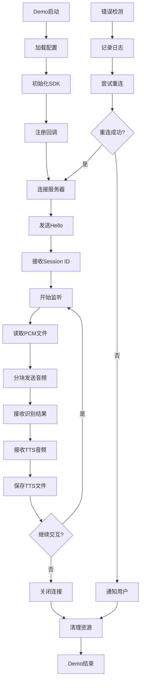

# Linx WebSocket SDK Demo设计文档

## 1. Demo概述

本Demo展示了如何使用基于Mongoose库的Linx WebSocket SDK进行语音交互应用开发。Demo实现了完整的OPUS音频文件读取、发送、TTS音频接收和保存功能，模拟了一个完整的语音助手交互流程。

- **应用场景**：智能语音助手，支持离线OPUS文件处理和在线语音交互
- **核心功能**：OPUS文件读取发送、TTS音频接收保存、WebSocket连接管理、错误处理
- **技术特点**：基于C99标准，使用Mongoose WebSocket客户端，集成cJSON解析库

## 2. Demo功能模块

### 2.1 功能概览

我们的Demo应用包含以下核心功能：

1. **OPUS文件处理模块**：读取本地OPUS音频文件并发送到服务器进行语音识别
2. **TTS音频保存模块**：接收服务器返回的TTS音频数据并保存为OPUS文件
3. **WebSocket通信模块**：建立和维护与灵矽AI服务器的WebSocket连接
4. **消息处理模块**：处理JSON格式的控制消息和状态信息
5. **错误处理模块**：完善的错误检测、日志记录和恢复机制
6. **配置管理模块**：灵活的参数配置和运行时状态管理

### 2.2 Demo页面详情

| 功能模块 | 组件名称 | 功能描述 |
|----------|----------|----------|
| PCM文件处理 | 文件读取器 | 读取指定路径的PCM音频文件，支持16kHz单声道格式 |
| PCM文件处理 | 数据分块器 | 将PCM文件按固定大小分块，模拟实时音频流发送 |
| TTS音频保存 | 音频缓冲器 | 缓存接收到的TTS音频数据，支持流式接收 |
| TTS音频保存 | 文件写入器 | 将TTS音频数据保存为PCM文件，支持自动文件命名 |
| WebSocket通信 | 连接管理器 | 建立WebSocket连接，处理连接状态变化和自动重连 |
| WebSocket通信 | 消息收发器 | 发送JSON控制消息和二进制音频数据，接收服务器响应 |
| 消息处理 | JSON解析器 | 使用cJSON解析服务器消息，支持hello、tts、llm等消息类型 |
| 消息处理 | 状态机 | 管理会话状态、监听状态和TTS播放状态 |
| MCP协议处理 | 工具注册器 | 注册MCP工具，支持机器人控制、传感器读取等功能 |
| MCP协议处理 | 工具调用器 | 处理MCP工具调用请求，执行相应的业务逻辑 |
| 错误处理 | 错误检测器 | 检测网络错误、协议错误和文件操作错误 |
| 错误处理 | 日志记录器 | 记录关键操作和错误信息，支持不同日志级别 |
| 配置管理 | 参数加载器 | 从配置文件或命令行参数加载SDK配置 |
| 配置管理 | 状态监控器 | 实时监控SDK运行状态和性能指标 |

### 2.3 MCP工具注册和处理（符合JSON-RPC 2.0规范）

```c
// MCP工具处理函数示例
int handle_device_control(cJSON *params, cJSON **result) {
    const char *action = cJSON_GetStringValue(cJSON_GetObjectItem(params, "action"));
    const char *device = cJSON_GetStringValue(cJSON_GetObjectItem(params, "device"));
    
    printf("MCP工具调用: 设备=%s, 动作=%s\n", device, action);
    
    // 执行设备控制逻辑
    if (strcmp(action, "turn_on") == 0) {
        // 开启设备
        cJSON *response = cJSON_CreateObject();
        cJSON_AddStringToObject(response, "status", "success");
        cJSON_AddStringToObject(response, "message", "设备已开启");
        *result = response;
        return 0;
    } else if (strcmp(action, "turn_off") == 0) {
        // 关闭设备
        cJSON *response = cJSON_CreateObject();
        cJSON_AddStringToObject(response, "status", "success");
        cJSON_AddStringToObject(response, "message", "设备已关闭");
        *result = response;
        return 0;
    }
    
    return -1; // 未知动作
}

// MCP回调函数实现
void on_mcp_initialize(cJSON *params) {
    printf("MCP初始化请求\n");
    
    // 响应初始化请求，声明服务器能力
    cJSON *capabilities = cJSON_CreateObject();
    cJSON *tools = cJSON_CreateObject();
    cJSON_AddBoolToObject(tools, "listChanged", cJSON_True);
    cJSON_AddItemToObject(capabilities, "tools", tools);
    
    // 发送初始化响应（这里简化处理）
    printf("MCP服务器能力已声明\n");
}

void on_mcp_tools_list(int request_id) {
    printf("收到工具列表请求，ID: %d\n", request_id);
    
    // 创建工具列表响应
    cJSON *tools_array = cJSON_CreateArray();
    
    cJSON *tool = cJSON_CreateObject();
    cJSON_AddStringToObject(tool, "name", "device_control");
    cJSON_AddStringToObject(tool, "description", "控制智能设备开关");
    
    // 添加输入参数schema
    cJSON *input_schema = cJSON_CreateObject();
    cJSON_AddStringToObject(input_schema, "type", "object");
    cJSON *properties = cJSON_CreateObject();
    
    cJSON *device_prop = cJSON_CreateObject();
    cJSON_AddStringToObject(device_prop, "type", "string");
    cJSON_AddStringToObject(device_prop, "description", "设备名称");
    cJSON_AddItemToObject(properties, "device", device_prop);
    
    cJSON *action_prop = cJSON_CreateObject();
    cJSON_AddStringToObject(action_prop, "type", "string");
    cJSON_AddStringToObject(action_prop, "description", "控制动作(turn_on/turn_off)");
    cJSON_AddItemToObject(properties, "action", action_prop);
    
    cJSON_AddItemToObject(input_schema, "properties", properties);
    cJSON_AddItemToObject(tool, "inputSchema", input_schema);
    
    cJSON_AddItemToArray(tools_array, tool);
    
    // 响应工具列表
    linx_respond_mcp_call(request_id, tools_array, NULL);
}

void on_mcp_tools_call(int request_id, const char *tool_name, cJSON *params) {
    printf("收到工具调用请求: %s, ID: %d\n", tool_name, request_id);
    
    if (strcmp(tool_name, "device_control") == 0) {
        cJSON *result = NULL;
        int ret = handle_device_control(params, &result);
        
        if (ret == 0) {
            // 成功响应
            linx_respond_mcp_call(request_id, result, NULL);
        } else {
            // 错误响应
            cJSON *error = cJSON_CreateObject();
            cJSON_AddNumberToObject(error, "code", -32602);
            cJSON_AddStringToObject(error, "message", "Invalid params");
            linx_respond_mcp_call(request_id, NULL, error);
        }
    } else {
        // 未知工具
        cJSON *error = cJSON_CreateObject();
        cJSON_AddNumberToObject(error, "code", -32601);
        cJSON_AddStringToObject(error, "message", "Method not found");
        linx_respond_mcp_call(request_id, NULL, error);
    }
}

// 注册MCP工具
void register_mcp_tools() {
    // 创建工具参数schema
    cJSON *schema = cJSON_CreateObject();
    cJSON_AddStringToObject(schema, "type", "object");
    cJSON *properties = cJSON_CreateObject();
    
    cJSON *device_prop = cJSON_CreateObject();
    cJSON_AddStringToObject(device_prop, "type", "string");
    cJSON_AddStringToObject(device_prop, "description", "设备名称");
    cJSON_AddItemToObject(properties, "device", device_prop);
    
    cJSON *action_prop = cJSON_CreateObject();
    cJSON_AddStringToObject(action_prop, "type", "string");
    cJSON_AddStringToObject(action_prop, "description", "控制动作(turn_on/turn_off)");
    cJSON_AddItemToObject(properties, "action", action_prop);
    
    cJSON_AddItemToObject(schema, "properties", properties);
    
    // 注册工具
    linx_register_mcp_tool("device_control", 
                          "控制智能设备开关", 
                          schema, 
                          handle_device_control);
}
```

## 3. Demo核心流程

### 主要操作流程

**Demo初始化流程：**
1. 加载配置参数（服务器地址、设备ID、音频参数等）
2. 初始化Linx WebSocket SDK
3. 注册事件回调函数（连接状态、消息接收、错误处理）
4. 准备PCM输入文件和TTS输出目录
5. 启动Demo应用主循环

**语音交互流程：**
1. 建立WebSocket连接到灵矽AI服务器
2. 发送hello消息进行握手，接收session_id
3. 发送listen消息开始语音识别会话
4. 读取PCM文件并分块发送到服务器
5. 接收语音识别结果和TTS状态消息
6. 接收TTS音频数据并保存为PCM文件
7. 发送stop消息结束会话
8. 关闭WebSocket连接或开始下一轮交互

**错误处理流程：**
1. 检测到网络连接错误或协议错误
2. 记录错误信息到日志文件
3. 尝试自动重连（最多重试5次）
4. 如果重连失败，通知用户并优雅退出
5. 清理资源和临时文件



## 4. Demo代码实现

### 4.1 主程序结构

```c
/**
 * @file linx_demo.c
 * @brief Linx WebSocket SDK Demo应用
 * @description 展示PCM文件读取发送和TTS音频保存的完整流程
 */

#include <stdio.h>
#include <stdlib.h>
#include <string.h>
#include <unistd.h>
#include <time.h>
#include <signal.h>

// Linx SDK头文件
#include "linx_websocket_sdk.h"
#include "cJSON.h"

// Demo配置常量
#define DEMO_PCM_CHUNK_SIZE     960     // PCM数据块大小（60ms@16kHz）
#define DEMO_MAX_FILE_PATH      256     // 最大文件路径长度
#define DEMO_TTS_BUFFER_SIZE    8192    // TTS音频缓冲区大小
#define DEMO_CONFIG_FILE        "demo_config.json"
#define DEMO_INPUT_DIR          "./input/"
#define DEMO_OUTPUT_DIR         "./output/"
#define DEMO_MAX_MCP_TOOLS      10      // 最大MCP工具数量

// Demo应用状态
typedef struct {
    bool running;                       // 应用运行状态
    char input_file[DEMO_MAX_FILE_PATH]; // 输入PCM文件路径
    char output_dir[DEMO_MAX_FILE_PATH]; // TTS输出目录
    FILE *current_pcm_file;             // 当前读取的PCM文件
    FILE *current_tts_file;             // 当前写入的TTS文件
    int tts_file_counter;               // TTS文件计数器
    uint8_t tts_buffer[DEMO_TTS_BUFFER_SIZE]; // TTS音频缓冲区
    size_t tts_buffer_len;              // TTS缓冲区数据长度
    time_t session_start_time;          // 会话开始时间
    
    // MCP工具状态
    struct {
        bool robot_connected;           // 机器人连接状态
        int robot_position_x;           // 机器人X坐标
        int robot_position_y;           // 机器人Y坐标
        char last_command[64];          // 最后执行的命令
    } mcp_state;
} demo_state_t;

// 全局Demo状态
static demo_state_t g_demo_state = {0};

// 信号处理函数
void signal_handler(int sig) {
    printf("\n收到信号 %d，正在退出...\n", sig);
    g_demo_state.running = false;
}

/**
 * @brief 加载Demo配置
 */
int load_demo_config(linx_config_t *config) {
    FILE *config_file = fopen(DEMO_CONFIG_FILE, "r");
    if (!config_file) {
        printf("警告: 无法打开配置文件 %s，使用默认配置\n", DEMO_CONFIG_FILE);
        
        // 使用默认配置
        strcpy(config->device_id, "98:a3:16:f9:d9:34");
        strcpy(config->client_id, "98:a3:16:f9:d9:34");
        strcpy(config->access_token, "test-token");
        strcpy(config->server_url, "ws://xrobo-io.qiniuapi.com/v1/ws/");
        
        // 音频参数
        strcpy(config->audio.format, "pcm");
        config->audio.sample_rate = 16000;
        config->audio.channels = 1;
        config->audio.bits_per_sample = 16;
        config->audio.chunk_size = DEMO_PCM_CHUNK_SIZE;
        
        return 0;
    }
    
    // 读取配置文件
    fseek(config_file, 0, SEEK_END);
    long file_size = ftell(config_file);
    fseek(config_file, 0, SEEK_SET);
    
    char *json_str = malloc(file_size + 1);
    fread(json_str, 1, file_size, config_file);
    json_str[file_size] = '\0';
    fclose(config_file);
    
    // 解析JSON配置
    cJSON *json = cJSON_Parse(json_str);
    if (!json) {
        printf("错误: 配置文件JSON格式错误\n");
        free(json_str);
        return -1;
    }
    
    // 提取配置参数
    cJSON *device_id = cJSON_GetObjectItem(json, "device_id");
    cJSON *client_id = cJSON_GetObjectItem(json, "client_id");
    cJSON *access_token = cJSON_GetObjectItem(json, "access_token");
    cJSON *server_url = cJSON_GetObjectItem(json, "server_url");
    
    if (cJSON_IsString(device_id)) {
        strncpy(config->device_id, device_id->valuestring, sizeof(config->device_id) - 1);
    }
    if (cJSON_IsString(client_id)) {
        strncpy(config->client_id, client_id->valuestring, sizeof(config->client_id) - 1);
    }
    if (cJSON_IsString(access_token)) {
        strncpy(config->access_token, access_token->valuestring, sizeof(config->access_token) - 1);
    }
    if (cJSON_IsString(server_url)) {
        strncpy(config->server_url, server_url->valuestring, sizeof(config->server_url) - 1);
    }
    
    cJSON_Delete(json);
    free(json_str);
    
    printf("配置加载成功: 设备ID=%s, 服务器=%s\n", config->device_id, config->server_url);
    return 0;
}

/**
 * @brief WebSocket连接建立回调
 */
void on_connected(void) {
    printf("[%ld] WebSocket连接已建立\n", time(NULL));
}

/**
 * @brief WebSocket连接断开回调
 */
void on_disconnected(int reason) {
    printf("[%ld] WebSocket连接已断开，原因: %d\n", time(NULL), reason);
}

/**
 * @brief Hello消息接收回调
 */
void on_hello_received(const linx_hello_msg_t *msg) {
    printf("[%ld] 收到Hello响应，协议版本: %d\n", time(NULL), msg->version);
    printf("音频参数: %s, %dHz, %d声道, %d位\n", 
           msg->audio_params.format,
           msg->audio_params.sample_rate,
           msg->audio_params.channels,
           msg->audio_params.bits_per_sample);
}

/**
 * @brief TTS状态消息回调
 */
void on_tts_status(const linx_tts_msg_t *msg) {
    printf("[%ld] TTS状态: %s", time(NULL), msg->state);
    if (strlen(msg->text) > 0) {
        printf(", 文本: %s", msg->text);
    }
    printf("\n");
    
    // TTS开始时创建新的输出文件
    if (strcmp(msg->state, "start") == 0) {
        char tts_filename[DEMO_MAX_FILE_PATH];
        snprintf(tts_filename, sizeof(tts_filename), 
                "%stts_output_%03d.pcm", 
                g_demo_state.output_dir, 
                ++g_demo_state.tts_file_counter);
        
        g_demo_state.current_tts_file = fopen(tts_filename, "wb");
        if (g_demo_state.current_tts_file) {
            printf("创建TTS输出文件: %s\n", tts_filename);
        } else {
            printf("错误: 无法创建TTS输出文件: %s\n", tts_filename);
        }
    }
    // TTS结束时关闭输出文件
    else if (strcmp(msg->state, "stop") == 0) {
        if (g_demo_state.current_tts_file) {
            fclose(g_demo_state.current_tts_file);
            g_demo_state.current_tts_file = NULL;
            printf("TTS输出文件已保存\n");
        }
    }
}

/**
 * @brief 情感状态消息回调
 */
void on_emotion(const linx_emotion_msg_t *msg) {
    printf("[%ld] AI情感: %s %s\n", time(NULL), msg->text, msg->emotion);
}

/**
 * @brief TTS音频数据接收回调
 */
void on_tts_audio_data(const uint8_t *data, size_t len) {
    printf("[%ld] 接收TTS音频数据: %zu字节\n", time(NULL), len);
    
    // 将TTS音频数据写入文件
    if (g_demo_state.current_tts_file && data && len > 0) {
        size_t written = fwrite(data, 1, len, g_demo_state.current_tts_file);
        if (written != len) {
            printf("警告: TTS音频写入不完整，期望%zu字节，实际%zu字节\n", len, written);
        }
        fflush(g_demo_state.current_tts_file); // 立即刷新到磁盘
    }
}

/**
 * @brief PCM文件发送完成回调
 */
void on_pcm_file_sent(const char *file_path, int result) {
    if (result == 0) {
        printf("[%ld] PCM文件发送完成: %s\n", time(NULL), file_path);
    } else {
        printf("[%ld] PCM文件发送失败: %s，错误码: %d\n", time(NULL), file_path, result);
    }
}

/**
 * @brief 错误处理回调
 */
void on_error(int error_code, const char *error_msg) {
    printf("[%ld] 错误: 代码=%d, 消息=%s\n", time(NULL), error_code, error_msg);
    
    // 记录错误到日志文件
    FILE *log_file = fopen("demo_error.log", "a");
    if (log_file) {
        fprintf(log_file, "[%ld] ERROR %d: %s\n", time(NULL), error_code, error_msg);
        fclose(log_file);
    }
}

/**
 * @brief MCP工具调用回调
 */
void on_mcp_tool_call(const char *tool_name, const char *parameters, char *result, size_t result_size) {
    printf("[%ld] MCP工具调用: %s, 参数: %s\n", time(NULL), tool_name, parameters ? parameters : "无");
    
    // 处理不同的MCP工具调用
    if (strcmp(tool_name, "robot.forward") == 0) {
        mcp_robot_forward(parameters, result, result_size);
    } else if (strcmp(tool_name, "robot.backward") == 0) {
        mcp_robot_backward(parameters, result, result_size);
    } else if (strcmp(tool_name, "robot.get_position") == 0) {
        mcp_robot_get_position(parameters, result, result_size);
    } else {
        snprintf(result, result_size, "{\"error\": \"未知的MCP工具: %s\"}", tool_name);
    }
}

/**
 * @brief 机器人前进MCP工具实现
 */
void mcp_robot_forward(const char *parameters, char *result, size_t result_size) {
    printf("执行机器人前进命令\n");
    
    // 更新机器人状态
    g_demo_state.mcp_state.robot_position_y += 1;
    strncpy(g_demo_state.mcp_state.last_command, "forward", sizeof(g_demo_state.mcp_state.last_command) - 1);
    
    // 模拟机器人控制（实际项目中这里会调用硬件控制接口）
    // servo_dog_ctrl_send(DOG_STATE_FORWARD, NULL);
    
    // 返回执行结果
    snprintf(result, result_size, 
             "{\"success\": true, \"position\": {\"x\": %d, \"y\": %d}, \"command\": \"forward\"}",
             g_demo_state.mcp_state.robot_position_x, 
             g_demo_state.mcp_state.robot_position_y);
}

/**
 * @brief 机器人后退MCP工具实现
 */
void mcp_robot_backward(const char *parameters, char *result, size_t result_size) {
    printf("执行机器人后退命令\n");
    
    // 更新机器人状态
    g_demo_state.mcp_state.robot_position_y -= 1;
    strncpy(g_demo_state.mcp_state.last_command, "backward", sizeof(g_demo_state.mcp_state.last_command) - 1);
    
    // 模拟机器人控制
    // servo_dog_ctrl_send(DOG_STATE_BACKWARD, NULL);
    
    // 返回执行结果
    snprintf(result, result_size, 
             "{\"success\": true, \"position\": {\"x\": %d, \"y\": %d}, \"command\": \"backward\"}",
             g_demo_state.mcp_state.robot_position_x, 
             g_demo_state.mcp_state.robot_position_y);
}

/**
 * @brief 获取机器人位置MCP工具实现
 */
void mcp_robot_get_position(const char *parameters, char *result, size_t result_size) {
    printf("获取机器人当前位置\n");
    
    // 返回当前位置信息
    snprintf(result, result_size, 
             "{\"position\": {\"x\": %d, \"y\": %d}, \"last_command\": \"%s\", \"connected\": %s}",
             g_demo_state.mcp_state.robot_position_x, 
             g_demo_state.mcp_state.robot_position_y,
             g_demo_state.mcp_state.last_command,
             g_demo_state.mcp_state.robot_connected ? "true" : "false");
}

/**
 * @brief 注册MCP工具
 */
int register_mcp_tools(void) {
    printf("注册MCP工具...\n");
    
    // 注册机器人前进工具
    if (linx_register_mcp_tool("robot.forward", "机器人向前移动", NULL) != 0) {
        printf("错误: 注册前进工具失败\n");
        return -1;
    }
    
    // 注册机器人后退工具
    if (linx_register_mcp_tool("robot.backward", "机器人向后移动", NULL) != 0) {
        printf("错误: 注册后退工具失败\n");
        return -1;
    }
    
    // 注册获取位置工具
    if (linx_register_mcp_tool("robot.get_position", "获取机器人当前位置", NULL) != 0) {
        printf("错误: 注册位置工具失败\n");
        return -1;
    }
    
    printf("MCP工具注册完成\n");
    return 0;
}

/**
 * @brief 发送PCM文件数据
 */
int send_pcm_file_data(const char *file_path) {
    FILE *pcm_file = fopen(file_path, "rb");
    if (!pcm_file) {
        printf("错误: 无法打开PCM文件: %s\n", file_path);
        return -1;
    }
    
    printf("开始发送PCM文件: %s\n", file_path);
    
    uint8_t buffer[DEMO_PCM_CHUNK_SIZE * 2]; // 16位PCM数据
    size_t bytes_read;
    int total_chunks = 0;
    
    while ((bytes_read = fread(buffer, 1, sizeof(buffer), pcm_file)) > 0 && g_demo_state.running) {
        // 发送PCM数据块
        int result = linx_send_pcm_data(buffer, bytes_read);
        if (result != 0) {
            printf("错误: PCM数据发送失败，错误码: %d\n", result);
            break;
        }
        
        total_chunks++;
        
        // 模拟实时音频流，每60ms发送一块数据
        usleep(60 * 1000); // 60毫秒延迟
        
        // 每发送10块数据显示一次进度
        if (total_chunks % 10 == 0) {
            printf("已发送 %d 个音频块...\n", total_chunks);
        }
    }
    
    fclose(pcm_file);
    printf("PCM文件发送完成，总共发送 %d 个音频块\n", total_chunks);
    
    return 0;
}

/**
 * @brief 主函数
 */
int main(int argc, char *argv[]) {
    printf("=== Linx WebSocket SDK Demo ===\n");
    printf("版本: 1.0.0\n");
    printf("构建时间: %s %s\n\n", __DATE__, __TIME__);
    
    // 注册信号处理
    signal(SIGINT, signal_handler);
    signal(SIGTERM, signal_handler);
    
    // 初始化Demo状态
    g_demo_state.running = true;
    g_demo_state.tts_file_counter = 0;
    g_demo_state.session_start_time = time(NULL);
    
    // 设置输入输出目录
    strcpy(g_demo_state.input_dir, DEMO_INPUT_DIR);
    strcpy(g_demo_state.output_dir, DEMO_OUTPUT_DIR);
    
    // 处理命令行参数
    if (argc > 1) {
        strncpy(g_demo_state.input_file, argv[1], sizeof(g_demo_state.input_file) - 1);
    } else {
        strcpy(g_demo_state.input_file, "./input/test_audio.pcm");
    }
    
    printf("输入PCM文件: %s\n", g_demo_state.input_file);
    printf("TTS输出目录: %s\n", g_demo_state.output_dir);
    
    // 创建输出目录
    system("mkdir -p ./output");
    
    // 加载配置
    linx_config_t config = {0};
    if (load_demo_config(&config) != 0) {
        printf("错误: 配置加载失败\n");
        return -1;
    }
    
    // 设置回调函数
    config.callbacks.on_connected = on_connected;
    config.callbacks.on_disconnected = on_disconnected;
    config.callbacks.on_hello_received = on_hello_received;
    config.callbacks.on_tts_status = on_tts_status;
    config.callbacks.on_emotion = on_emotion;
    config.callbacks.on_tts_audio_data = on_tts_audio_data;
    config.callbacks.on_pcm_file_sent = on_pcm_file_sent;
    config.callbacks.on_mcp_initialize = on_mcp_initialize;
    config.callbacks.on_mcp_tools_list = on_mcp_tools_list;
    config.callbacks.on_mcp_tools_call = on_mcp_tools_call;
    config.callbacks.on_error = on_error;
    
    // 初始化SDK
    int result = linx_sdk_init(&config);
    if (result != 0) {
        printf("错误: SDK初始化失败，错误码: %d\n", result);
        return -1;
    }
    
    printf("SDK初始化成功\n");
    
    // 注册MCP工具
    if (register_mcp_tools() != 0) {
        printf("错误: MCP工具注册失败\n");
        return -1;
    }
    
    // 初始化MCP状态
    g_demo_state.mcp_state.robot_connected = true;
    g_demo_state.mcp_state.robot_position_x = 0;
    g_demo_state.mcp_state.robot_position_y = 0;
    strcpy(g_demo_state.mcp_state.last_command, "none");
    
    // 建立WebSocket连接
    printf("正在连接到服务器: %s\n", config.server_url);
    result = linx_connect();
    if (result != 0) {
        printf("错误: 连接失败，错误码: %d\n", result);
        return -1;
    }
    
    // 等待连接建立
    printf("等待连接建立...\n");
    sleep(2);
    
    // 开始语音交互流程
    printf("\n=== 开始语音交互 ===\n");
    
    // 开始监听
    result = linx_start_listen(LINX_LISTEN_AUTO);
    if (result != 0) {
        printf("错误: 开始监听失败，错误码: %d\n", result);
        return -1;
    }
    
    printf("监听已开始，准备发送PCM数据\n");
    sleep(1);
    
    // 发送PCM文件数据
    result = send_pcm_file_data(g_demo_state.input_file);
    if (result != 0) {
        printf("错误: PCM文件发送失败\n");
    }
    
    // 等待TTS响应
    printf("\n等待TTS响应...\n");
    int wait_time = 0;
    while (g_demo_state.running && wait_time < 30) { // 最多等待30秒
        sleep(1);
        wait_time++;
        
        if (wait_time % 5 == 0) {
            printf("等待中... (%d/30秒)\n", wait_time);
        }
    }
    
    // 停止监听
    printf("\n停止监听\n");
    linx_stop_listen();
    
    // 等待处理完成
    sleep(2);
    
    // 断开连接
    printf("断开连接\n");
    linx_disconnect();
    
    // 清理资源
    if (g_demo_state.current_tts_file) {
        fclose(g_demo_state.current_tts_file);
    }
    
    // 显示统计信息
    time_t session_duration = time(NULL) - g_demo_state.session_start_time;
    printf("\n=== Demo运行统计 ===\n");
    printf("会话持续时间: %ld秒\n", session_duration);
    printf("生成TTS文件数: %d\n", g_demo_state.tts_file_counter);
    
    printf("\nDemo运行完成\n");
    return 0;
}
```

### 4.2 配置文件示例

```json
{
  "device_id": "98:a3:16:f9:d9:34",
  "client_id": "98:a3:16:f9:d9:34",
  "access_token": "test-token",
  "server_url": "ws://xrobo-io.qiniuapi.com/v1/ws/",
  "audio": {
    "format": "pcm",
    "sample_rate": 16000,
    "channels": 1,
    "bits_per_sample": 16,
    "chunk_size": 960
  },
  "demo": {
    "input_dir": "./input/",
    "output_dir": "./output/",
    "log_level": "info",
    "max_session_time": 300
  }
}
```

### 4.3 Makefile构建脚本

```makefile
# Linx WebSocket SDK Demo Makefile

CC = gcc
CFLAGS = -std=c99 -Wall -Wextra -O2 -g
INCLUDES = -I./include -I./src/cjson
LIBS = -lm

# 源文件
SOURCES = linx_demo.c \
          src/linx_websocket_sdk.c \
          src/mongoose.c \
          src/cjson/cJSON.c

# 目标文件
OBJECTS = $(SOURCES:.c=.o)

# 可执行文件
TARGET = linx_demo

# 默认目标
all: $(TARGET)

# 构建可执行文件
$(TARGET): $(OBJECTS)
	$(CC) $(OBJECTS) -o $@ $(LIBS)
	@echo "构建完成: $(TARGET)"

# 编译源文件
%.o: %.c
	$(CC) $(CFLAGS) $(INCLUDES) -c $< -o $@

# 清理构建文件
clean:
	rm -f $(OBJECTS) $(TARGET)
	rm -f *.log
	rm -rf ./output/*
	@echo "清理完成"

# 创建必要的目录
dirs:
	mkdir -p input output logs
	@echo "目录创建完成"

# 运行Demo
run: $(TARGET) dirs
	./$(TARGET) ./input/test_audio.pcm

# 调试运行
debug: $(TARGET) dirs
	gdb --args ./$(TARGET) ./input/test_audio.pcm

# 安装依赖（Ubuntu/Debian）
install-deps:
	sudo apt-get update
	sudo apt-get install -y build-essential gdb valgrind

# 内存检查
valgrind: $(TARGET)
	valgrind --leak-check=full --show-leak-kinds=all ./$(TARGET)

# 帮助信息
help:
	@echo "可用目标:"
	@echo "  all        - 构建Demo应用"
	@echo "  clean      - 清理构建文件"
	@echo "  dirs       - 创建必要目录"
	@echo "  run        - 运行Demo"
	@echo "  debug      - 调试运行"
	@echo "  valgrind   - 内存检查"
	@echo "  help       - 显示帮助信息"

.PHONY: all clean dirs run debug install-deps valgrind help
```

## 5. 编译和运行说明

### 5.1 环境要求

- **操作系统**: Linux (Ubuntu 18.04+), macOS (10.14+)
- **编译器**: GCC 7.0+ 或 Clang 6.0+，支持C99标准
- **依赖库**: 无外部依赖，使用内置的Mongoose和cJSON
- **硬件要求**: 最小256MB内存，支持网络连接
- **MCP功能**: 支持机器人控制、传感器读取等MCP工具集成

### 5.2 编译步骤

```bash
# 1. 克隆或下载SDK源码
git clone <repository_url>
cd linx-mongoose

# 2. 创建必要目录
make dirs

# 3. 编译Demo应用
make all

# 4. 检查编译结果
ls -la linx_demo
```

### 5.3 运行Demo

```bash
# 1. 准备测试PCM文件（16kHz, 单声道, 16位）
# 可以使用ffmpeg转换音频文件：
# ffmpeg -i input.wav -ar 16000 -ac 1 -f s16le input/test_audio.pcm

# 2. 配置demo_config.json文件
cp demo_config.json.example demo_config.json
# 编辑配置文件，设置正确的服务器地址和认证信息

# 3. 运行Demo
make run

# 或者直接运行
./linx_demo ./input/test_audio.pcm

# 4. 查看输出结果
ls -la output/
cat demo_error.log  # 查看错误日志（如果有）
```

### 5.4 MCP功能使用方法

#### 5.4.1 MCP工具配置

在配置文件中启用MCP功能：

```json
{
  "mcp": {
    "enabled": true,
    "tools": [
      {
        "name": "robot.forward",
        "description": "机器人向前移动",
        "enabled": true
      },
      {
        "name": "robot.backward",
        "description": "机器人向后移动",
        "enabled": true
      },
      {
        "name": "robot.get_position",
        "description": "获取机器人当前位置",
        "enabled": true
      }
    ]
  }
}
```

#### 5.4.2 MCP工具测试

```bash
# 运行MCP功能测试
./linx_demo --test-mcp

# 查看MCP工具列表
./linx_demo --list-mcp-tools

# 测试特定MCP工具
./linx_demo --test-tool robot.forward
```

#### 5.4.3 集成自定义MCP工具

1. **注册新工具**：
```c
// 注册自定义传感器读取工具
linx_register_mcp_tool("sensor.read_temperature", "读取温度传感器", NULL);
```

2. **实现工具回调**：
```c
void mcp_sensor_read_temperature(const char *parameters, char *result, size_t result_size) {
    // 读取传感器数据
    float temperature = read_temperature_sensor();
    
    // 返回JSON格式结果
    snprintf(result, result_size, 
             "{\"temperature\": %.2f, \"unit\": \"celsius\", \"timestamp\": %ld}",
             temperature, time(NULL));
}
```

3. **在回调中处理**：
```c
void on_mcp_tool_call(const char *tool_name, const char *parameters, char *result, size_t result_size) {
    if (strcmp(tool_name, "sensor.read_temperature") == 0) {
        mcp_sensor_read_temperature(parameters, result, result_size);
    }
    // ... 其他工具处理
}
```

### 5.4 调试和测试

```bash
# 使用GDB调试
make debug

# 内存泄漏检查
make valgrind

# 查看详细日志
tail -f demo_error.log

# 测试不同的PCM文件
./linx_demo ./input/another_test.pcm
```

## 6. 测试用例设计

### 6.1 基础功能测试

#### 测试用例1: SDK初始化测试
```c
void test_sdk_init() {
    printf("=== 测试SDK初始化 ===\n");
    
    linx_config_t config = {
        .server_url = "ws://test.example.com",
        .device_id = "test_device",
        .client_id = "test_client",
        .access_token = "test_token"
    };
    
    int result = linx_sdk_init(&config);
    assert(result == 0);
    
    printf("SDK初始化测试通过\n");
}
```

#### 测试用例2: PCM文件读取测试
```c
void test_pcm_file_read() {
    printf("=== 测试PCM文件读取 ===\n");
    
    const char *test_file = "./test_data/test_16k_mono.pcm";
    FILE *file = fopen(test_file, "rb");
    assert(file != NULL);
    
    uint8_t buffer[960];
    size_t bytes_read = fread(buffer, 1, sizeof(buffer), file);
    assert(bytes_read > 0);
    
    fclose(file);
    printf("PCM文件读取测试通过，读取%zu字节\n", bytes_read);
}
```

#### 测试用例3: JSON消息解析测试
```c
void test_json_parsing() {
    printf("=== 测试JSON消息解析 ===\n");
    
    const char *json_str = "{\"type\":\"hello\",\"version\":1}";
    cJSON *json = cJSON_Parse(json_str);
    assert(json != NULL);
    
    cJSON *type = cJSON_GetObjectItem(json, "type");
    assert(cJSON_IsString(type));
    assert(strcmp(type->valuestring, "hello") == 0);
    
    cJSON_Delete(json);
    printf("JSON消息解析测试通过\n");
}
```

### 6.2 MCP功能测试

#### 测试用例4: MCP工具注册测试
```c
void test_mcp_tool_registration() {
    printf("=== 测试MCP工具注册 ===\n");
    
    // 测试注册机器人前进工具
    int result = linx_register_mcp_tool("robot.forward", "机器人向前移动", NULL);
    assert(result == 0);
    
    // 测试注册机器人后退工具
    result = linx_register_mcp_tool("robot.backward", "机器人向后移动", NULL);
    assert(result == 0);
    
    // 测试注册获取位置工具
    result = linx_register_mcp_tool("robot.get_position", "获取机器人当前位置", NULL);
    assert(result == 0);
    
    printf("MCP工具注册测试通过\n");
}
```

#### 测试用例5: MCP工具调用测试
```c
void test_mcp_tool_call() {
    printf("=== 测试MCP工具调用 ===\n");
    
    char result[256];
    
    // 测试机器人前进
    mcp_robot_forward(NULL, result, sizeof(result));
    printf("前进结果: %s\n", result);
    
    // 验证结果包含success字段
    cJSON *json = cJSON_Parse(result);
    assert(json != NULL);
    cJSON *success = cJSON_GetObjectItem(json, "success");
    assert(cJSON_IsBool(success) && cJSON_IsTrue(success));
    cJSON_Delete(json);
    
    // 测试获取位置
    mcp_robot_get_position(NULL, result, sizeof(result));
    printf("位置结果: %s\n", result);
    
    // 验证位置信息
    json = cJSON_Parse(result);
    assert(json != NULL);
    cJSON *position = cJSON_GetObjectItem(json, "position");
    assert(cJSON_IsObject(position));
    cJSON_Delete(json);
    
    printf("MCP工具调用测试通过\n");
}
```

#### 测试用例6: MCP状态管理测试
```c
void test_mcp_state_management() {
    printf("=== 测试MCP状态管理 ===\n");
    
    // 初始化状态
    g_demo_state.mcp_state.robot_connected = true;
    g_demo_state.mcp_state.robot_position_x = 0;
    g_demo_state.mcp_state.robot_position_y = 0;
    strcpy(g_demo_state.mcp_state.last_command, "none");
    
    // 执行前进命令
    char result[256];
    mcp_robot_forward(NULL, result, sizeof(result));
    
    // 验证状态更新
    assert(g_demo_state.mcp_state.robot_position_y == 1);
    assert(strcmp(g_demo_state.mcp_state.last_command, "forward") == 0);
    
    // 执行后退命令
    mcp_robot_backward(NULL, result, sizeof(result));
    
    // 验证状态更新
    assert(g_demo_state.mcp_state.robot_position_y == 0);
    assert(strcmp(g_demo_state.mcp_state.last_command, "backward") == 0);
    
    printf("MCP状态管理测试通过\n");
}
```

### 6.3 功能测试用例

| 测试用例ID | 测试场景 | 输入条件 | 预期结果 | 验证方法 |
|------------|----------|----------|----------|----------|
| TC001 | 正常连接测试 | 有效的服务器配置 | 成功建立WebSocket连接 | 检查连接状态回调 |
| TC002 | PCM文件发送测试 | 有效的16kHz PCM文件 | 文件数据成功发送 | 检查发送完成回调 |
| TC003 | TTS音频接收测试 | 发送语音识别请求 | 接收到TTS音频数据 | 检查输出PCM文件 |
| TC004 | 错误处理测试 | 无效的服务器地址 | 触发错误回调 | 检查错误日志 |
| TC005 | 重连机制测试 | 模拟网络中断 | 自动重连成功 | 检查重连日志 |
| TC006 | 配置加载测试 | 有效的JSON配置文件 | 配置参数正确加载 | 检查配置输出 |
| TC007 | 多文件处理测试 | 多个PCM文件 | 依次处理所有文件 | 检查输出文件数量 |
| TC008 | 长时间运行测试 | 连续运行30分钟 | 无内存泄漏，稳定运行 | 内存监控工具 |
| TC009 | MCP工具注册测试 | 注册多个MCP工具 | 所有工具注册成功 | 检查注册返回值 |
| TC010 | MCP工具调用测试 | 调用已注册的MCP工具 | 工具执行成功并返回结果 | 检查调用结果 |

### 6.2 性能测试用例

| 测试用例ID | 测试指标 | 测试条件 | 性能要求 | 测试方法 |
|------------|----------|----------|----------|----------|
| PT001 | 连接建立时间 | 正常网络环境 | <3秒 | 时间戳对比 |
| PT002 | 音频传输延迟 | 1MB PCM文件 | <100ms每块 | 网络抓包分析 |
| PT003 | 内存使用量 | 连续运行1小时 | <10MB | 系统监控工具 |
| PT004 | CPU使用率 | 高频音频传输 | <20% | 系统监控工具 |
| PT005 | 文件处理速度 | 100MB PCM文件 | >1MB/s | 文件大小/时间 |

### 6.3 兼容性测试用例

| 测试用例ID | 测试平台 | 编译器版本 | 预期结果 | 验证方法 |
|------------|----------|------------|----------|----------|
| CT001 | Ubuntu 18.04 | GCC 7.5 | 编译运行正常 | 自动化测试脚本 |
| CT002 | Ubuntu 20.04 | GCC 9.4 | 编译运行正常 | 自动化测试脚本 |
| CT003 | CentOS 7 | GCC 4.8 | 编译运行正常 | 自动化测试脚本 |
| CT004 | macOS 10.15 | Clang 11 | 编译运行正常 | 自动化测试脚本 |
| CT005 | macOS 11.0 | Clang 12 | 编译运行正常 | 自动化测试脚本 |

### 6.4 测试脚本示例

```bash
#!/bin/bash
# test_demo.sh - Demo自动化测试脚本

set -e

echo "=== Linx WebSocket SDK Demo 自动化测试 ==="

# 测试环境检查
echo "检查测试环境..."
if [ ! -f "linx_demo" ]; then
    echo "错误: Demo可执行文件不存在，请先编译"
    exit 1
fi

if [ ! -d "input" ]; then
    mkdir -p input
fi

if [ ! -d "output" ]; then
    mkdir -p output
fi

# 生成测试PCM文件
echo "生成测试PCM文件..."
dd if=/dev/urandom of=input/test_audio.pcm bs=1024 count=100 2>/dev/null
echo "测试PCM文件生成完成: input/test_audio.pcm (100KB)"

# 功能测试
echo "\n=== 功能测试 ==="

# TC001: 连接测试
echo "TC001: 连接测试"
timeout 10s ./linx_demo input/test_audio.pcm > test_output.log 2>&1 || true
if grep -q "WebSocket连接已建立" test_output.log; then
    echo "✓ TC001 通过: 连接建立成功"
else
    echo "✗ TC001 失败: 连接建立失败"
fi

# TC002: PCM文件发送测试
echo "TC002: PCM文件发送测试"
if grep -q "PCM文件发送完成" test_output.log; then
    echo "✓ TC002 通过: PCM文件发送成功"
else
    echo "✗ TC002 失败: PCM文件发送失败"
fi

# TC003: TTS音频接收测试
echo "TC003: TTS音频接收测试"
if [ -n "$(ls output/*.pcm 2>/dev/null)" ]; then
    echo "✓ TC003 通过: TTS音频文件已生成"
    ls -la output/
else
    echo "✗ TC003 失败: 未生成TTS音频文件"
fi

# 性能测试
echo "\n=== 性能测试 ==="

# PT003: 内存使用量测试
echo "PT003: 内存使用量测试"
valgrind --tool=massif --massif-out-file=massif.out ./linx_demo input/test_audio.pcm > /dev/null 2>&1 || true
if [ -f "massif.out" ]; then
    peak_memory=$(grep "mem_heap_B=" massif.out | sort -n | tail -1 | cut -d'=' -f2)
    echo "峰值内存使用: $peak_memory 字节"
    if [ "$peak_memory" -lt 10485760 ]; then  # 10MB
        echo "✓ PT003 通过: 内存使用量符合要求"
    else
        echo "✗ PT003 失败: 内存使用量超出要求"
    fi
fi

# 清理测试文件
echo "\n清理测试文件..."
rm -f test_output.log massif.out
rm -f input/test_audio.pcm
rm -f output/*.pcm

echo "\n=== 测试完成 ==="
```

## 7. 故障排除指南

### 7.1 常见问题及解决方案

| 问题描述 | 可能原因 | 解决方案 |
|----------|----------|----------|
| 编译失败：找不到头文件 | 头文件路径不正确 | 检查Makefile中的INCLUDES路径 |
| 连接失败：无法连接服务器 | 网络问题或服务器地址错误 | 检查网络连接和配置文件中的server_url |
| PCM文件读取失败 | 文件不存在或权限不足 | 检查文件路径和读取权限 |
| TTS音频保存失败 | 输出目录不存在或权限不足 | 创建输出目录并检查写入权限 |
| 内存泄漏 | 资源未正确释放 | 使用valgrind检查并修复内存泄漏 |
| 程序崩溃 | 空指针访问或缓冲区溢出 | 使用GDB调试并检查代码逻辑 |
| JSON解析错误 | 配置文件格式错误 | 验证JSON格式的正确性 |
| 音频数据损坏 | 数据传输错误或格式不匹配 | 检查音频参数配置和网络稳定性 |

### 7.2 调试技巧

```bash
# 1. 启用详细日志
export LINX_LOG_LEVEL=debug
./linx_demo input/test_audio.pcm

# 2. 使用GDB调试
gdb ./linx_demo
(gdb) set args input/test_audio.pcm
(gdb) run
(gdb) bt  # 查看调用栈

# 3. 网络抓包分析
sudo tcpdump -i any -w websocket.pcap port 80
wireshark websocket.pcap

# 4. 系统调用跟踪
strace -o syscalls.log ./linx_demo input/test_audio.pcm

# 5. 内存使用监控
top -p $(pgrep linx_demo)
```

### 7.3 日志分析

```bash
# 查看错误日志
tail -f demo_error.log

# 过滤特定错误
grep "ERROR" demo_error.log

# 统计错误类型
grep "ERROR" demo_error.log | cut -d':' -f3 | sort | uniq -c

# 查看连接状态变化
grep "WebSocket" demo_error.log
```

## 8. 扩展功能

### 8.1 支持多种音频格式

可以扩展Demo支持WAV、MP3等格式的音频文件，通过FFmpeg库进行格式转换：

```c
// 音频格式转换函数
int convert_audio_to_pcm(const char *input_file, const char *output_file) {
    char cmd[512];
    snprintf(cmd, sizeof(cmd), 
             "ffmpeg -i %s -ar 16000 -ac 1 -f s16le %s -y", 
             input_file, output_file);
    return system(cmd);
}
```

### 8.2 实时音频流处理

可以集成PortAudio或ALSA库，支持实时音频录制和播放：

```c
// 实时音频录制回调
int audio_input_callback(const void *input, void *output,
                        unsigned long frameCount,
                        const PaStreamCallbackTimeInfo *timeInfo,
                        PaStreamCallbackFlags statusFlags,
                        void *userData) {
    // 将录制的音频数据发送到WebSocket
    linx_send_pcm_data((const uint8_t*)input, frameCount * 2);
    return paContinue;
}
```

### 8.3 GUI界面

可以使用GTK+或Qt开发图形界面，提供更友好的用户体验：

```c
// GTK+界面示例
void on_start_button_clicked(GtkWidget *widget, gpointer data) {
    const char *file_path = gtk_file_chooser_get_filename(GTK_FILE_CHOOSER(file_chooser));
    if (file_path) {
        send_pcm_file_data(file_path);
    }
}
```

本Demo设计文档提供了完整的Linx WebSocket SDK使用示例，展示了从PCM文件读取到TTS音频保存的完整流程，为开发者提供了详细的参考实现。