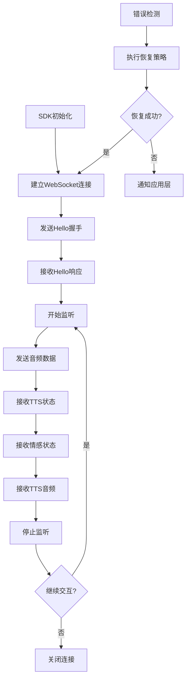

# 灵矽AI WebSocket嵌入式SDK产品需求文档

## 1. 产品概述

Linx WebSocket SDK是一个基于Mongoose库开发的C99标准WebSocket客户端SDK，专为OPUS音频数据传输和语音交互应用设计。SDK提供了完整的WebSocket连接管理、OPUS音频数据发送、TTS音频数据接收、以及与语音识别和合成服务的集成能力，同时支持MCP（Model Context Protocol）协议扩展。

- 主要解决OPUS音频数据传输和网络通信问题，为开发者提供稳定可靠的WebSocket连接和数据处理能力。
- 目标用户是需要集成语音交互功能的应用开发者，特别是实时音频处理应用、AI语音助手和智能硬件的开发团队。
- SDK通过标准化的API接口和事件回调机制，支持PCM数据的实时传输和MCP协议扩展，提升语音交互应用的开发效率。

## 2. 核心功能

### 2.1 用户角色

| 角色 | 注册方法 | 核心权限 |
|------|----------|----------|
| 设备开发者 | 获取设备ID和客户端ID | 集成SDK，配置设备参数，实现业务逻辑 |
| 终端用户 | 通过设备使用 | 语音交互，获得AI服务响应 |

### 2.2 功能模块

我们的WebSocket SDK需求包含以下主要模块：

1. **WebSocket连接器**：基于Mongoose库的连接管理，支持自动重连和心跳检测。
2. **OPUS音频处理器**：OPUS音频数据发送和TTS音频数据接收功能。
3. **消息处理器**：基于cJSON的JSON消息解析和生成，支持多种消息类型。
4. **事件管理器**：回调函数管理和事件分发机制。
5. **配置管理器**：SDK参数配置和运行时状态管理。
6. **MCP协议处理器**：支持Model Context Protocol工具注册和消息处理。

### 2.3 页面详情

| 页面名称 | 模块名称 | 功能描述 |
|----------|----------|----------|
| SDK初始化 | 配置管理器 | 初始化SDK配置，设置服务器地址、端口、认证信息等参数 |
| WebSocket连接 | WebSocket连接器 | 建立WebSocket连接，处理连接状态变化，支持自动重连 |
| OPUS数据发送 | OPUS音频处理器 | 发送OPUS音频数据到服务器进行语音识别 |
| TTS数据接收 | OPUS音频处理器 | 接收TTS合成的音频数据并通过回调处理 |
| 消息发送 | 消息处理器 | 发送JSON格式的控制消息和二进制音频数据 |
| 消息接收 | 消息处理器 | 接收和解析服务器返回的JSON消息和音频数据 |
| 事件回调 | 事件管理器 | 注册和触发各种事件回调函数，如连接状态、识别结果等 |
| MCP工具管理 | MCP协议处理器 | 注册和管理MCP工具，处理工具调用和资源访问请求 |
| 错误处理 | 配置管理器 | 统一的错误码定义和错误处理机制 |

## 3. 核心流程

### 主要操作流程

### 设备初始化流程
1. 调用`linx_sdk_init()`初始化SDK
2. 设置服务器配置参数
3. 注册事件回调函数
4. 初始化Mongoose网络管理器
5. SDK进入就绪状态

### OPUS音频数据处理流程
1. 调用`linx_connect()`建立WebSocket连接
2. 发送hello消息进行握手
3. 接收session_id，建立会话
4. 发送listen消息开始监听
5. 调用`linx_send_audio_data()`发送OPUS音频数据
6. 接收语音识别结果
7. 通过回调函数处理接收到的TTS音频数据
8. 发送stop消息结束会话
9. 断开WebSocket连接

### MCP协议扩展流程
1. 调用`linx_register_mcp_tool()`注册MCP工具
2. 接收MCP工具调用请求
3. 执行相应的工具处理函数
4. 返回工具执行结果
5. 处理MCP资源访问请求

**错误处理流程：**
1. 检测到连接或协议错误
2. 记录错误信息和状态
3. 执行恢复策略（重连、重发、重置）
4. 通知上层应用处理结果

## 4. 用户界面设计

### 4.1 设计风格

由于这是嵌入式SDK，不涉及图形界面设计，但需要考虑以下API设计原则：

- **简洁性**：API接口简单易用，函数命名清晰
- **一致性**：统一的命名规范和参数风格
- **可靠性**：完善的错误处理和状态反馈
- **高效性**：优化内存使用和CPU占用
- **兼容性**：严格遵循C99标准，支持多平台编译

### 4.2 API设计概览

| 模块 | API函数 | 设计要素 |
|------|---------|----------|
| 初始化模块 | linx_sdk_init() | 简洁的初始化接口，结构体参数传递，返回错误码 |
| 连接模块 | linx_connect() | 异步连接接口，回调函数通知连接状态 |
| 消息模块 | linx_send_message() | 统一的消息发送接口，支持不同消息类型 |
| 音频模块 | linx_send_audio_data() | OPUS音频数据发送接口，支持流式传输 |
| 控制模块 | linx_start_listen() | 监听控制接口，支持不同监听模式 |
| 错误处理 | linx_get_last_error() | 错误信息获取接口，提供详细错误描述 |

### 4.3 响应性

 SDK设计为事件驱动架构，支持异步操作和回调机制，适配嵌入式实时系统的响应性要求。提供非阻塞API接口，确保主线程不被长时间占用。