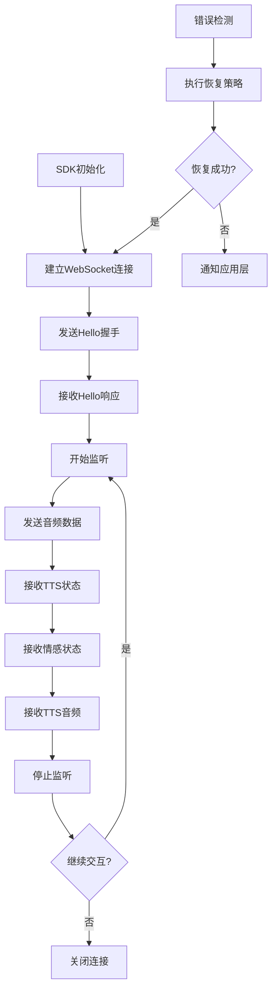

# 灵矽AI WebSocket嵌入式SDK产品需求文档

## 1. 产品概述

灵矽AI WebSocket嵌入式SDK是一个基于Mongoose库开发的C99标准WebSocket客户端SDK，专为嵌入式设备设计。SDK提供完整的灵矽AI语音交互能力，包括实时语音识别、TTS语音合成、智能对话和情感表达功能。

本SDK解决了嵌入式设备接入灵矽AI服务的技术难题，为IoT设备、智能硬件和嵌入式系统提供统一的AI语音交互接口。目标是成为嵌入式AI语音交互的标准化解决方案。

## 2. 核心功能

### 2.1 用户角色

| 角色 | 注册方法 | 核心权限 |
|------|----------|----------|
| 设备开发者 | 获取设备ID和客户端ID | 集成SDK，配置设备参数，实现业务逻辑 |
| 终端用户 | 通过设备使用 | 语音交互，获得AI服务响应 |

### 2.2 功能模块

我们的嵌入式SDK包含以下核心模块：

1. **连接管理模块**：WebSocket连接建立、握手协商、重连机制
2. **消息处理模块**：JSON消息解析、协议处理、状态管理
3. **音频传输模块**：原始音频数据回调、音频流传输、缓冲管理
4. **会话控制模块**：监听状态控制、会话生命周期管理
5. **错误处理模块**：异常检测、错误恢复、日志记录
6. **配置管理模块**：参数配置、设备信息管理

### 2.3 页面详情

| 模块名称 | 功能组件 | 功能描述 |
|----------|----------|----------|
| 连接管理模块 | WebSocket连接器 | 建立WSS连接，设置请求头参数（Protocol-Version、Device-Id、Client-Id、Authorization），处理连接状态变化 |
| 连接管理模块 | 握手处理器 | 发送hello消息，接收服务器响应，协商音频参数（PCM格式、采样率、声道数、位深度） |
| 连接管理模块 | 重连机制 | 检测连接断开，实现指数退避重连，最大重试次数控制 |
| 消息处理模块 | JSON解析器 | 解析服务器JSON消息，支持hello、tts、llm、abort等消息类型 |
| 消息处理模块 | 协议处理器 | 处理listen控制消息（start/stop/detect），管理监听模式（auto/manual/realtime） |
| 消息处理模块 | 状态机 | 维护连接状态、监听状态、会话状态，处理状态转换 |
| 音频传输模块 | 音频回调处理器 | 通过回调函数传递上行音频数据（16kHz），接收下行TTS音频（24kHz） |
| 音频传输模块 | 音频缓冲器 | 管理音频数据缓冲，处理音频流的发送和接收 |
| 音频传输模块 | 二进制传输 | 通过WebSocket发送和接收原始音频二进制数据 |
| 会话控制模块 | 监听控制器 | 发送监听开始/停止消息，处理唤醒词检测，管理会话ID |
| 会话控制模块 | TTS状态处理 | 处理TTS播放状态（start/stop/sentence_start），提取播放文本 |
| 会话控制模块 | 情感状态处理 | 处理AI情感状态消息，支持20种情感类型，提供表情符号和情感标识 |
| 错误处理模块 | 异常检测器 | 检测网络异常、协议错误、音频错误，提供错误码和错误描述 |
| 错误处理模块 | 恢复机制 | 实现自动恢复策略，包括重连、重发、状态重置 |
| 错误处理模块 | 日志系统 | 记录关键操作和错误信息，支持不同日志级别 |
| 配置管理模块 | 参数配置 | 管理设备ID、客户端ID、服务器地址、音频参数等配置 |
| 配置管理模块 | 内存管理 | 优化内存使用，适配嵌入式环境的资源限制 |

## 3. 核心流程

### 主要操作流程

**设备初始化流程：**
1. 初始化SDK配置（设备ID、客户端ID、服务器地址）
2. 设置音频参数（PCM格式、采样率、声道数、位深度）
3. 注册回调函数（消息处理、音频处理、错误处理）
4. 启动连接管理器

**语音交互流程：**
1. 建立WebSocket连接并完成握手
2. 发送监听开始消息
3. 采集并发送音频数据
4. 接收TTS状态和情感状态消息
5. 接收并播放TTS音频数据
6. 结束监听或继续下一轮交互

**错误处理流程：**
1. 检测到连接或协议错误
2. 记录错误信息和状态
3. 执行恢复策略（重连、重发、重置）
4. 通知上层应用处理结果

## 4. 用户界面设计

### 4.1 设计风格

由于这是嵌入式SDK，不涉及图形界面设计，但需要考虑以下API设计原则：

- **简洁性**：API接口简单易用，函数命名清晰
- **一致性**：统一的命名规范和参数风格
- **可靠性**：完善的错误处理和状态反馈
- **高效性**：优化内存使用和CPU占用
- **兼容性**：严格遵循C99标准，支持多平台编译

### 4.2 API设计概览

| 模块 | API函数 | 设计要素 |
|------|---------|----------|
| 初始化模块 | linx_sdk_init() | 简洁的初始化接口，结构体参数传递，返回错误码 |
| 连接模块 | linx_connect() | 异步连接接口，回调函数通知连接状态 |
| 消息模块 | linx_send_message() | 统一的消息发送接口，支持不同消息类型 |
| 音频模块 | linx_send_audio() | 音频数据发送接口，支持流式传输 |
| 控制模块 | linx_start_listen() | 监听控制接口，支持不同监听模式 |
| 错误处理 | linx_get_last_error() | 错误信息获取接口，提供详细错误描述 |

### 4.3 响应性

 SDK设计为事件驱动架构，支持异步操作和回调机制，适配嵌入式实时系统的响应性要求。提供非阻塞API接口，确保主线程不被长时间占用。