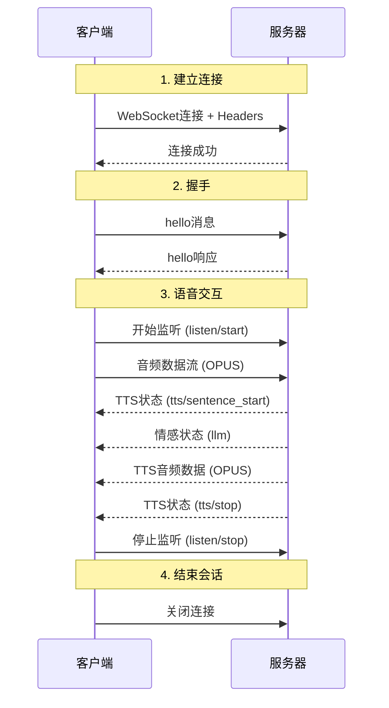
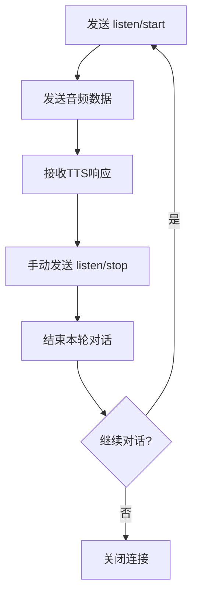
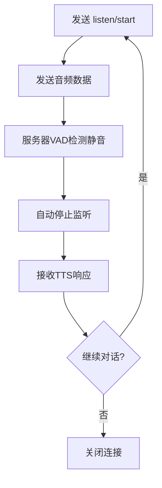

# WebSocket 接入文档

## 目录

- [概述](#概述)
- [快速开始](#快速开始)
- [连接建立](#连接建立)
- [消息协议](#消息协议)
- [会话流程](#会话流程)
- [完整示例](#完整示例)
- [错误处理](#错误处理)
- [常见问题](#常见问题)

## 概述

### 什么是 WebSocket 协议

WebSocket 是小智设备与服务器进行实时语音交互的核心协议。它提供了全双工通信通道，支持：

- 🎤 **实时语音识别**：将设备音频流实时转换为文字
- 🔊 **语音合成播放**：接收服务器TTS音频并播放
- 💬 **智能对话**：与大语言模型进行自然语言交互
- 😊 **情感表达**：获取AI的情感状态用于设备表情显示

### 核心特性

| 特性 | 说明 |
|------|------|
| **全双工通信** | 客户端和服务器可同时发送和接收消息 |
| **持久连接** | 单次连接支持多轮对话，减少连接开销 |
| **低延迟** | 实时音频流传输，延迟极低 |
| **多模式支持** | 支持自动、手动、实时三种监听模式 |

### 基本信息

| 项目 | 值 |
|------|-----|
| **WebSocket 地址** | `wss://xrobo-io.qiniuapi.com/v1/ws/` |
| **协议版本** | `1` |
| **音频格式** | `OPUS` |
| **采样率** | `16000Hz` (上行) / `24000Hz` (下行) |
| **通道数** | `1` (单声道) |
| **帧长** | `60ms` |

## 快速开始

### 前置条件

在建立WebSocket连接之前，请确保：

- ✅ 设备已通过 [OTA协议](./OTA.md) 获取激活码
- ✅ 设备已连接到稳定的网络
- ✅ 已获取有效的访问令牌（如果启用认证）
- ✅ 设备支持OPUS音频编解码

### 最小连接示例

```javascript
// 1. 建立WebSocket连接
const ws = new WebSocket('wss://xrobo-io.qiniuapi.com/v1/ws/', [], {
  headers: {
    'Protocol-Version': '1',
    'Device-Id': 'D4:06:06:B6:A9:FB',
    'Client-Id': 'web_test_client',
    'Authorization': 'Bearer your_access_token' // 可选
  }
});

// 2. 发送hello消息
ws.onopen = () => {
  ws.send(JSON.stringify({
    type: "hello",
    version: 1,
    transport: "websocket",
    audio_params: {
      format: "opus",
      sample_rate: 16000,
      channels: 1,
      frame_duration: 60
    }
  }));
};

// 3. 处理服务器响应
ws.onmessage = (event) => {
  if (typeof event.data === 'string') {
    const message = JSON.parse(event.data);
    console.log('收到消息:', message);
  } else {
    console.log('收到音频数据:', event.data);
  }
};
```

## 连接建立

### 连接参数

建立WebSocket连接时需要在请求头中携带以下参数：

| 参数名 | 类型 | 必需 | 说明 | 示例 |
|--------|------|------|------|------|
| `Protocol-Version` | string | ✅ | 协议版本号 | `"1"` |
| `Device-Id` | string | ✅ | 设备MAC地址（需预注册） | `"D4:06:06:B6:A9:FB"` |
| `Client-Id` | string | ✅ | 设备UUID | `"web_test_client"` |
| `Authorization` | string | ❌ | 访问令牌（如果启用认证） | `"Bearer token123"` |

### Hello 握手

#### 客户端发送

```json
{
  "type": "hello",
  "version": 1,
  "transport": "websocket",
  "audio_params": {
    "format": "opus",
    "sample_rate": 16000,
    "channels": 1,
    "frame_duration": 60
  }
}
```

#### 服务器响应

```json
{
  "type": "hello",
  "transport": "websocket",
  "audio_params": {
    "format": "opus",
    "sample_rate": 24000,  // 服务器下行采样率
    "channels": 1,
    "frame_duration": 60
  }
}
```

## 消息协议

### 消息类型概览

| 消息类型 | 发送方向 | 说明 | 数据格式 | 触发时机 |
|----------|----------|------|----------|----------|
| `hello` | 🔄 **双向** | 连接握手消息 | JSON | 连接建立后立即发送 |
| `listen` | 📤 **客户端 → 服务器** | 监听状态控制 | JSON | 开始/停止语音识别时 |
| `audio` | 🔄 **双向** | 音频数据流 | 二进制(OPUS) | 语音输入/TTS输出时 |
| `tts` | 📥 **服务器 → 客户端** | TTS播放状态 | JSON | 语音合成状态变化时 |
| `llm` | 📥 **服务器 → 客户端** | AI情感状态 | JSON | AI回复时的情感表达 |
| `abort` | 📤 **客户端 → 服务器** | 中止当前会话 | JSON | 需要打断对话时 |

---

## 详细消息格式

### 1. Hello 握手消息 🔄

#### 客户端发送 (📤 Client → Server)

**用途：** 建立连接后的协议握手，协商音频参数

```json
{
  "type": "hello",
  "version": 1,
  "transport": "websocket",
  "audio_params": {
    "format": "opus",        // 音频编码格式
    "sample_rate": 16000,    // 客户端上行采样率
    "channels": 1,           // 声道数
    "frame_duration": 60     // 帧长度(ms)
  }
}
```

#### 服务器响应 (📥 Server → Client)

**用途：** 确认连接并返回服务器音频参数

```json
{
  "type": "hello",
  "transport": "websocket",
  "audio_params": {
    "format": "opus",        // 音频编码格式
    "sample_rate": 24000,    // 服务器下行采样率
    "channels": 1,           // 声道数
    "frame_duration": 60     // 帧长度(ms)
  }
}
```

---

### 2. Listen 监听控制消息 📤

**发送方向：** 客户端 → 服务器  
**用途：** 控制语音识别的开始、停止和模式

#### 开始监听

```json
{
  "session_id": "session_12345",     // 可选，会话标识
  "type": "listen",
  "state": "start",
  "mode": "auto"                     // 监听模式：auto | manual | realtime
}
```

#### 停止监听

```json
{
  "session_id": "session_12345",     // 可选，会话标识
  "type": "listen",
  "state": "stop"
}
```

#### 唤醒词检测

```json
{
  "session_id": "session_12345",     // 可选，会话标识
  "type": "listen",
  "state": "detect",
  "text": "小智小智"                   // 检测到的唤醒词
}
```

**监听模式说明：**

| 模式 | 说明 | 停止方式 | 适用场景 |
|------|------|----------|----------|
| `auto` | 自动停止 | 服务器VAD检测到静音 | 一般对话场景 |
| `manual` | 手动停止 | 客户端发送stop消息 | 需要精确控制的场景 |
| `realtime` | 持续监听 | 需要AEC支持，实时处理 | 实时交互场景 |

---

### 3. Audio 音频数据 🔄

**发送方向：** 双向  
**数据格式：** 二进制 OPUS 编码  
**用途：** 传输语音输入和TTS输出音频

#### 客户端发送音频 (📤 Client → Server)

```javascript
// 发送OPUS编码的音频数据
const audioData = new Uint8Array([...]); // OPUS编码的音频帧
websocket.send(audioData);
```

**音频参数要求：**
- 编码格式：OPUS
- 采样率：16000Hz
- 声道数：1 (单声道)
- 帧长：60ms

#### 服务器发送音频 (📥 Server → Client)

```javascript
// 接收OPUS编码的TTS音频数据
websocket.onmessage = (event) => {
  if (event.data instanceof ArrayBuffer) {
    // 这是TTS音频数据，可直接播放
    playAudio(event.data);
  }
};
```

**音频参数：**
- 编码格式：OPUS
- 采样率：24000Hz
- 声道数：1 (单声道)
- 帧长：60ms

---

### 4. TTS 状态消息 📥

**发送方向：** 服务器 → 客户端  
**用途：** 通知客户端TTS播放状态变化

#### TTS 开始播放

```json
{
  "type": "tts",
  "state": "start"
}
```

#### TTS 停止播放

```json
{
  "type": "tts",
  "state": "stop"
}
```

#### TTS 新句子开始

```json
{
  "type": "tts",
  "state": "sentence_start",
  "text": "你好，我是灵矽小助手"    // 当前播放的句子内容
}
```

**TTS 状态说明：**

| 状态值 | 说明 | 包含文本字段 | 触发时机 |
|--------|------|--------------|----------|
| `start` | 开始播放TTS | ❌ | TTS音频开始输出 |
| `stop` | 停止播放TTS | ❌ | TTS音频结束输出 |
| `sentence_start` | 新句子开始播放 | ✅ | 每个句子开始播放时 |

---

### 5. LLM 情感状态消息 📥

**发送方向：** 服务器 → 客户端  
**用途：** 传递AI的情感状态，用于设备表情显示

```json
{
  "type": "llm",
  "text": "😊",                        // 情感表情符号
  "emotion": "happy"                 // 情感类型标识
}
```

**支持的情感类型：**

| 表情 | 情感标识 | 中文描述 | 使用场景 |
|------|----------|----------|----------|
| 😶 | `neutral` | 中性 | 默认状态 |
| 🙂 | `happy` | 开心 | 积极回应 |
| 😆 | `laughing` | 大笑 | 幽默内容 |
| 😂 | `funny` | 搞笑 | 有趣对话 |
| 😔 | `sad` | 悲伤 | 同情安慰 |
| 😠 | `angry` | 生气 | 表达不满 |
| 😭 | `crying` | 哭泣 | 极度悲伤 |
| 😍 | `loving` | 喜爱 | 表达喜欢 |
| 😳 | `embarrassed` | 尴尬 | 尴尬场面 |
| 😲 | `surprised` | 惊讶 | 意外情况 |
| 😱 | `shocked` | 震惊 | 极度惊讶 |
| 🤔 | `thinking` | 思考 | 思考问题 |
| 😉 | `winking` | 眨眼 | 调皮暗示 |
| 😎 | `cool` | 酷 | 自信表现 |
| 😌 | `relaxed` | 放松 | 轻松状态 |
| 🤤 | `delicious` | 美味 | 食物相关 |
| 😘 | `kissy` | 亲吻 | 亲密表达 |
| 😏 | `confident` | 自信 | 自信回应 |
| 😴 | `sleepy` | 困倦 | 疲倦状态 |
| 😜 | `silly` | 调皮 | 顽皮表现 |
| 🙄 | `confused` | 困惑 | 不理解时 |

---

### 6. Abort 中止消息 📤

**发送方向：** 客户端 → 服务器  
**用途：** 主动中止当前会话或对话

```json
{
  "session_id": "session_12345",           // 可选，会话标识
  "type": "abort",
  "reason": "wake_word_detected"           // 可选，中止原因
}
```

**常见中止原因：**

| 原因标识 | 说明 | 使用场景 |
|----------|------|----------|
| `wake_word_detected` | 检测到新的唤醒词 | 用户重新唤醒设备 |
| `user_interrupt` | 用户主动打断 | 用户按键或手势打断 |
| `timeout` | 会话超时 | 长时间无交互 |
| `error` | 发生错误 | 系统异常需要重置 |
| `manual` | 手动中止 | 用户明确要求停止 |

## 会话流程

### 完整交互时序图



### 监听模式状态流程

#### Manual 模式流程


#### Auto 模式流程


### 音频数据传输

#### 音频格式要求

| 参数 | 客户端上行 | 服务器下行 |
|------|------------|------------|
| **编码格式** | OPUS | OPUS |
| **采样率** | 16000Hz | 24000Hz |
| **通道数** | 1 (单声道) | 1 (单声道) |
| **帧长** | 60ms | 60ms |
| **传输方式** | WebSocket二进制帧 | WebSocket二进制帧 |

#### 音频数据流

```javascript
// 发送音频数据示例
function sendAudioData(audioBuffer) {
  // audioBuffer 应该是 OPUS 编码的音频数据
  if (ws.readyState === WebSocket.OPEN) {
    ws.send(audioBuffer); // 直接发送二进制数据
  }
}

// 接收音频数据示例
ws.onmessage = (event) => {
  if (event.data instanceof ArrayBuffer) {
    // 这是 OPUS 编码的 TTS 音频数据
    playAudioData(event.data);
  } else {
    // 这是 JSON 消息
    const message = JSON.parse(event.data);
    handleMessage(message);
  }
};
```

## 完整示例

### JavaScript 完整实现

```javascript
classLin xWebSocket {
  constructor(deviceId, clientId, accessToken = null) {
    this.deviceId = deviceId;
    this.clientId = clientId;
    this.accessToken = accessToken;
    this.ws = null;
    this.isConnected = false;
    this.sessionId = null;
  }

  // 建立连接
  async connect() {
    const headers = {
      'Protocol-Version': '1',
      'Device-Id': this.deviceId,
      'Client-Id': this.clientId
    };
    
    if (this.accessToken) {
      headers['Authorization'] = `Bearer ${this.accessToken}`;
    }

    this.ws = new WebSocket('wss://xrobo-io.qiniuapi.com/v1/ws/', [], {
      headers: headers
    });

    return new Promise((resolve, reject) => {
      this.ws.onopen = () => {
        console.log('WebSocket 连接已建立');
        this.sendHello();
      };

      this.ws.onmessage = (event) => {
        this.handleMessage(event);
      };

      this.ws.onclose = (event) => {
        console.log('WebSocket 连接已关闭', event.code, event.reason);
        this.isConnected = false;
      };

      this.ws.onerror = (error) => {
        console.error('WebSocket 错误:', error);
        reject(error);
      };

      // 等待 hello 响应
      this.onHelloReceived = resolve;
    });
  }

  // 发送 hello 消息
  sendHello() {
    const helloMessage = {
      type: "hello",
      version: 1,
      transport: "websocket",
      audio_params: {
        format: "opus",
        sample_rate: 16000,
        channels: 1,
        frame_duration: 60
      }
    };
    
    this.send(helloMessage);
  }

  // 处理消息
  handleMessage(event) {
    if (typeof event.data === 'string') {
      const message = JSON.parse(event.data);
      
      switch (message.type) {
        case 'hello':
          console.log('收到 hello 响应:', message);
          this.isConnected = true;
          if (this.onHelloReceived) {
            this.onHelloReceived();
          }
          break;
          
        case 'tts':
          console.log('TTS 状态:', message);
          this.onTTSStatus && this.onTTSStatus(message);
          break;
          
        case 'llm':
          console.log('情感状态:', message);
          this.onEmotion && this.onEmotion(message);
          break;
          
        default:
          console.log('未知消息类型:', message);
      }
    } else {
      // 二进制音频数据
      console.log('收到音频数据:', event.data.byteLength, '字节');
      this.onAudioData && this.onAudioData(event.data);
    }
  }

  // 开始监听
  startListening(mode = 'auto') {
    const message = {
      session_id: this.sessionId || '',
      type: 'listen',
      state: 'start',
      mode: mode
    };
    
    this.send(message);
  }

  // 停止监听
  stopListening() {
    const message = {
      session_id: this.sessionId || '',
      type: 'listen',
      state: 'stop'
    };
    
    this.send(message);
  }

  // 发送音频数据
  sendAudio(audioBuffer) {
    if (this.isConnected && this.ws.readyState === WebSocket.OPEN) {
      this.ws.send(audioBuffer);
    }
  }

  // 中止会话
  abort(reason = null) {
    const message = {
      session_id: this.sessionId || '',
      type: 'abort'
    };
    
    if (reason) {
      message.reason = reason;
    }
    
    this.send(message);
  }

  // 发送 JSON 消息
  send(message) {
    if (this.ws && this.ws.readyState === WebSocket.OPEN) {
      this.ws.send(JSON.stringify(message));
    }
  }

  // 关闭连接
  close() {
    if (this.ws) {
      this.ws.close();
    }
  }
}

// 使用示例
const client = newLinxWebSocket(
  'D4:06:06:B6:A9:FB',  // Device ID
  'web_test_client',     // Client ID
  'your_access_token'    // Access Token (可选)
);

// 设置事件处理器
client.onTTSStatus = (message) => {
  console.log('TTS状态变化:', message.state, message.text);
};

client.onEmotion = (message) => {
  console.log('AI情感:', message.emotion, message.text);
  // 更新设备表情显示
  updateDeviceExpression(message.emotion);
};

client.onAudioData = (audioData) => {
  // 播放接收到的TTS音频
  playTTSAudio(audioData);
};

// 连接并开始对话
async function startConversation() {
  try {
    await client.connect();
    console.log('连接成功，开始监听...');
    client.startListening('auto');
    
    // 模拟发送音频数据
    // const audioData = await recordAudio();
    // client.sendAudio(audioData);
    
  } catch (error) {
    console.error('连接失败:', error);
  }
}

startConversation();
```

## 错误处理

### 常见错误类型

| 错误类型 | 原因 | 解决方案 |
|----------|------|----------|
| **连接失败** | 网络问题、服务器不可达 | 检查网络连接，实现重连机制 |
| **认证失败** | Token无效或过期 | 刷新Token，重新获取访问权限 |
| **设备未注册** | Device-Id未在服务器注册 | 联系管理员注册设备 |
| **协议版本不匹配** | Protocol-Version不支持 | 更新客户端到支持的协议版本 |
| **音频格式错误** | 音频编码格式不正确 | 确保使用OPUS编码，参数正确 |

### 重连机制实现

```javascript
class ReconnectingWebSocket extendsLinxWebSocket {
  constructor(deviceId, clientId, accessToken = null) {
    super(deviceId, clientId, accessToken);
    this.maxReconnectAttempts = 5;
    this.reconnectInterval = 1000; // 1秒
    this.reconnectAttempts = 0;
  }

  async connect() {
    try {
      await super.connect();
      this.reconnectAttempts = 0; // 重置重连计数
    } catch (error) {
      console.error('连接失败:', error);
      this.scheduleReconnect();
    }
  }

  scheduleReconnect() {
    if (this.reconnectAttempts < this.maxReconnectAttempts) {
      this.reconnectAttempts++;
      console.log(`${this.reconnectInterval}ms 后进行第 ${this.reconnectAttempts} 次重连...`);
      
      setTimeout(() => {
        this.connect();
      }, this.reconnectInterval);
      
      // 指数退避
      this.reconnectInterval = Math.min(this.reconnectInterval * 2, 30000);
    } else {
      console.error('达到最大重连次数，停止重连');
    }
  }

  // 重写 onclose 处理
  setupEventHandlers() {
    this.ws.onclose = (event) => {
      console.log('连接关闭:', event.code, event.reason);
      this.isConnected = false;
      
      // 如果不是正常关闭，尝试重连
      if (event.code !== 1000) {
        this.scheduleReconnect();
      }
    };
  }
}
```

### 错误处理最佳实践

```javascript
// 1. 网络状态监控
window.addEventListener('online', () => {
  console.log('网络已连接，尝试重连...');
  if (!client.isConnected) {
    client.connect();
  }
});

window.addEventListener('offline', () => {
  console.log('网络已断开');
});

// 2. 心跳检测
function startHeartbeat() {
  setInterval(() => {
    if (client.isConnected) {
      // 发送心跳消息或检查连接状态
      if (client.ws.readyState !== WebSocket.OPEN) {
        console.log('检测到连接异常，尝试重连...');
        client.connect();
      }
    }
  }, 30000); // 30秒检查一次
}

// 3. 音频错误处理
function handleAudioError(error) {
  console.error('音频处理错误:', error);
  
  switch (error.type) {
    case 'encoding_error':
      console.log('音频编码错误，检查OPUS编码器');
      break;
    case 'playback_error':
      console.log('音频播放错误，检查音频设备');
      break;
    default:
      console.log('未知音频错误');
  }
}
```

## 常见问题

### Q: WebSocket连接建立后立即断开怎么办？
A: 检查以下几点：
1. Device-Id是否已在服务器注册
2. Protocol-Version是否正确
3. 网络防火墙是否阻止WebSocket连接
4. 如果启用认证，检查Authorization token是否有效

### Q: 音频数据发送后没有收到TTS响应？
A: 可能的原因：
1. 音频格式不正确（确保使用OPUS编码）
2. 音频数据损坏或为空
3. 没有发送开始监听消息
4. 服务器端语音识别失败

### Q: 如何判断当前监听状态？
A: 通过跟踪发送的listen消息状态：
- 发送`listen/start`后进入监听状态
- 收到`tts/start`表示开始接收响应
- 收到`tts/stop`表示响应结束
- 发送`listen/stop`或自动停止后退出监听状态

### Q: 情感状态消息的作用是什么？
A: 情感状态消息用于：
1. 设备表情显示（LED、屏幕等）
2. 增强用户交互体验
3. 提供AI当前"心情"的可视化反馈

### Q: 如何处理网络不稳定的情况？
A: 建议实现：
1. 自动重连机制（指数退避策略）
2. 网络状态监控
3. 心跳检测
4. 本地缓存机制
5. 优雅降级（网络差时降低音频质量）

### Q: 支持同时连接多个WebSocket吗？
A: 一个设备（Device-Id）同时只能建立一个WebSocket连接。新连接会导致旧连接被服务器主动断开。

### Q: 如何优化音频传输性能？
A: 优化建议：
1. 使用适当的OPUS编码参数
2. 控制音频帧大小（推荐60ms）
3. 避免频繁的小数据包传输
4. 实现音频缓冲机制
5. 根据网络状况动态调整音频质量
